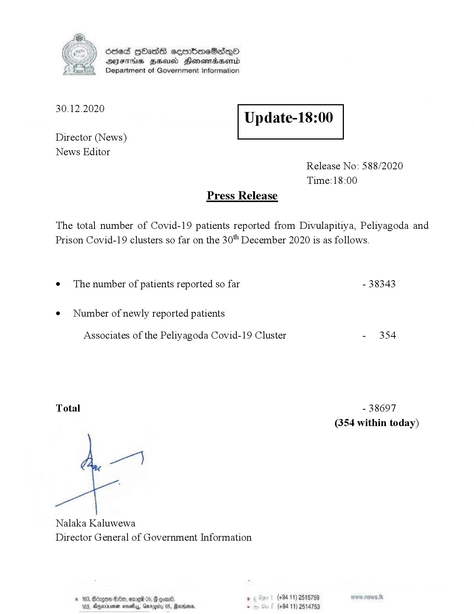

# Press Release - 2020.12.30 
Key: ab169f5a4a7cd57d65668d8d60b6aaa2 

---
```
Ssed HbasG sembmeSadqo
DAIS BHU Honomasentd
Department of Government Information

 

 

30.12.2020

Update-18:00

 

 

 

Director (News)
News Editor
Release No: 588/2020
Time:18:00
Press Release

The total number of Covid-19 patients reported from Divulapitiya, Peliyagoda and
Prison Covid-19 clusters so far on the 30" December 2020 is as follows.

e¢ The number of patients reported so far - 38343

¢ Number of newly reported patients

Associates of the Peliyagoda Covid-19 Cluster - 354

Total - 38697
(354 within today)

Nalaka Kaluwewa
Director General of Government Information

© 163, Bdagoe Se, ome 05, § con®, , (+9411) 2515759
163, Agere sosetyy, Gmrogity 05, Rano, - (+94 11) 2514753

```
