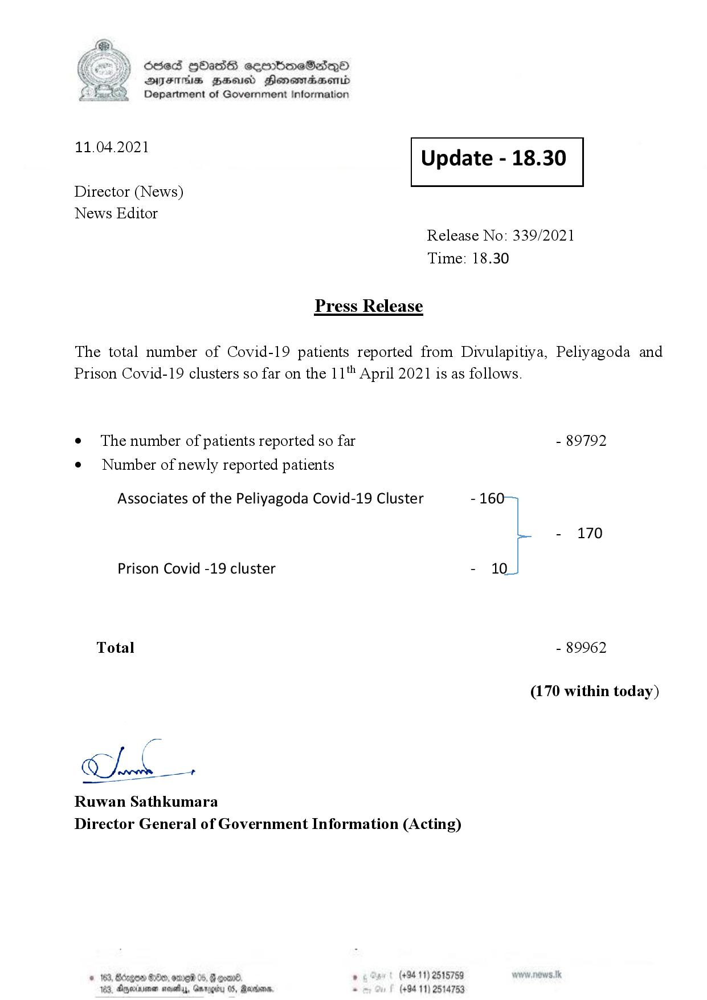

# Press Release - 2021.04.11 
Key: abd4ba68d2ba56b737ff5577574ba1f9 

---
```
\) O63 GOadS ceortimeSzdQO
AIFS BHU Henewmadasentd
Department of Government Information

 

 

11.04.2021 Update - 18.30

 

 

 

Director (News)

News Editor
Release No: 339/2021
Time: 18.30

Press Release

The total number of Covid-19 patients reported from Divulapitiya, Peliyagoda and
Prison Covid-19 clusters so far on the 11" April 2021 is as follows.

e¢ The number of patients reported so far - 89792

¢ Number of newly reported patients

Associates of the Peliyagoda Covid-19 Cluster - 16
- 170
Prison Covid -19 cluster - 10
Total - 89962
(170 within today)

Chk

Ruwan Sathkumara
Director General of Government Information (Acting)

© 163, Bizgoe 89, omre 05, & coan® , (+94 11) 2515759
183, Dyminvemen novels, arog 05, Marden. . (+94 11) 2514753

 

```
