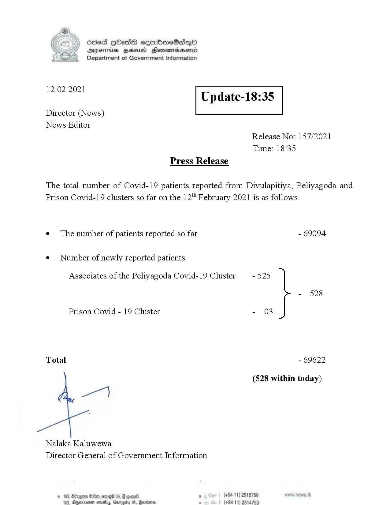

# Press Release - 2021.02.12 
Key: abdc6d72745e96412df141dcd230416e 

---
```
>) Sed HOadS ceorbmeSedeQ®
DAIS BHU Honomasentd
Department of Government Information

 

 

12.02.2021

Update-18:35

 

 

 

Director (News)

News Editor
Release No: 157/2021

Time: 18:35
Press Release

The total number of Covid-19 patients reported from Divulapitiya, Peliyagoda and
Prison Covid-19 clusters so far on the 12" February 2021 is as follows.
e¢ The number of patients reported so far - 69094

¢ Number of newly reported patients

Associates of the Peliyagoda Covid-19 Cluster - 525

- 528
Prison Covid - 19 Cluster - 03
Total - 69622
(528 within today)

ey

Nalaka Kaluwewa
Director General of Government Information

. (+94 11) 2515789
(+94 11) 2514753

 

```
