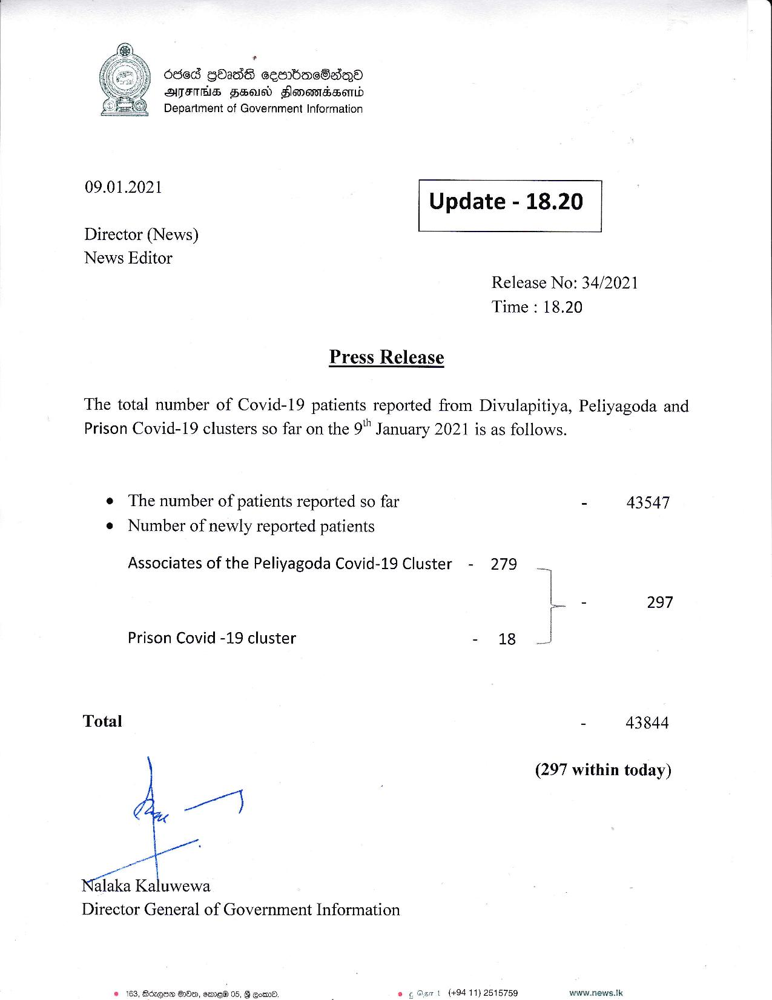

# Press Release - 2021.01.09 
Key: ac0617e8a0cb88bd399b04ad12b76233 

---
```
   

)) Oded GOadS cembasOadqQo
ATES FEIN Hlonomrasserd
Department of Government Information

 

09.01.2021 Update - 18.20

 

 

 

Director (News)
News Editor

Release No: 34/2021
Time : 18.20

Press Release

The total number of Covid-19 patients reported from Divulapitiya, Peliyagoda and
Prison Covid-19 clusters so far on the 9" January 2021 is as follows.

e The number of patients reported so far - 43547

¢ Number of newly reported patients
Associates of the Peliyagoda Covid-19 Cluster - 279

ss 297

Prison Covid -19 cluster - 18 J

Total - 43844

(297 within today)

wy

alaka Kaluwewa
Director General of Government Information

 

Qe HOO, eme@ 05, linet (+94 11) 2515759 www.news.Ik

   

 

 

```
