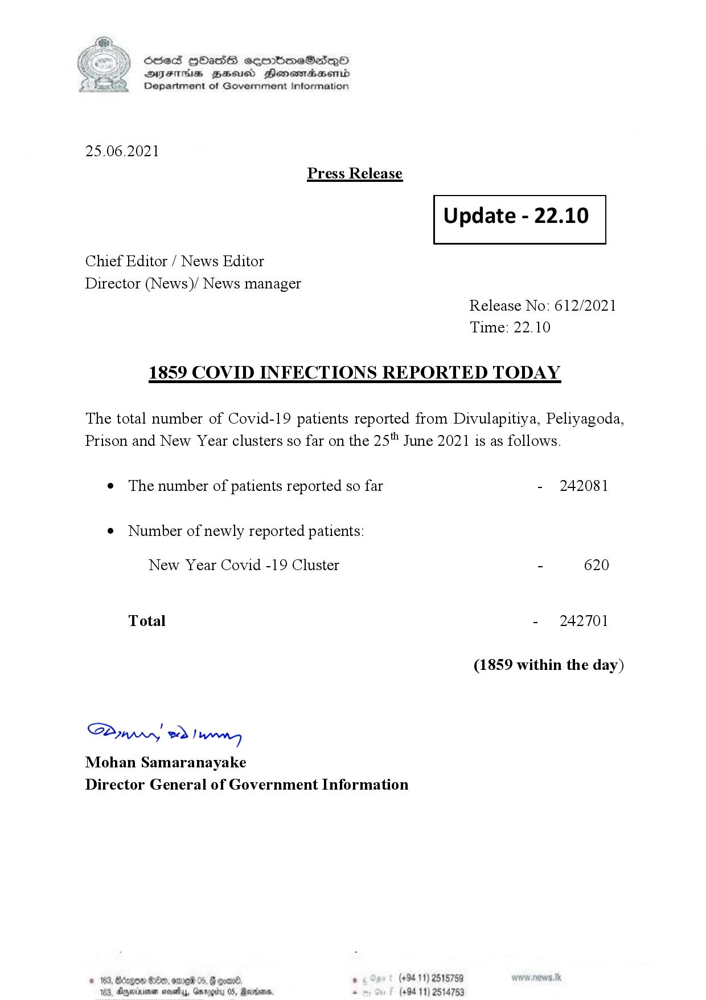

# Press Release - 2021.06.25 - Covid 19 infection report 
Key: ac37c6a2c34a5b0b9360f5904d27cfd5 

---
```
(6 S) ScseS HOasdS cerrbmeSdQo
DFTs BHEosd Henewtaeasernid
Department of Government Information

 

25.06.2021
Press Release

Chief Editor / News Editor
Director (News)/ News manager

 

 

Update - 22.10

 

 

Release No: 612/2021
Time: 22.10

1859 COVID INFECTIONS REPORTED TODAY

The total number of Covid-19 patients reported from Divulapitiya, Peliyagoda,
Prison and New Year clusters so far on the 25" June 2021 is as follows.

e The number of patients reported so far

¢ Number of newly reported patients:

New Year Covid -19 Cluster

Total

Saw 2) won,
Mohan Samaranayake
Director General of Government Information

© 163, ong

 

- 242081

- 620

- 242701

(1859 within the day)

00, ome 05, § qoar® , (+94 11) 2515759

103, Ageinvemen wos, Garg 05, Randers. . (+94 11) 2514753

```
