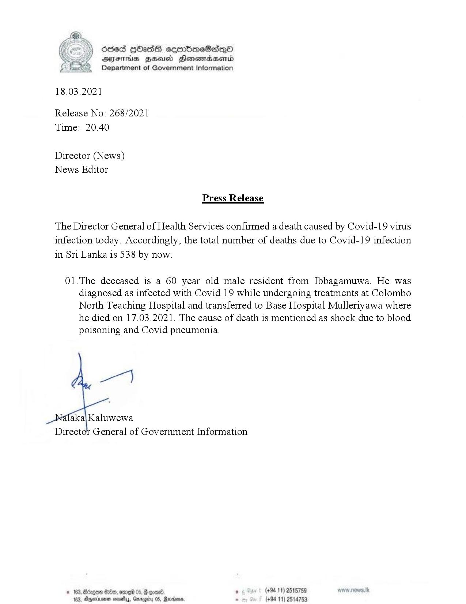

# Press Release - 2021.03.18 - Covid 19 infection deaths 
Key: ac47801f92c9085578c6b4d51696db22 

---
```
dosed HbHasG sembmeSadqoO
AFIS BHU Honewmadsentd
Department of Government Information

 

18.03.2021
Release No: 268/2021
Time: 20.40

Director (News)
News Editor

Press Release
The Director General of Health Services confirmed a death caused by Covid-19 virus

infection today. Accordingly, the total number of deaths due to Covid-19 infection
in Sri Lanka is 538 by now.

01.The deceased is a 60 year old male resident from Ibbagamuwa. He was
diagnosed as infected with Covid 19 while undergoing treatments at Colombo
North Teaching Hospital and transferred to Base Hospital Mulleriyawa where
he died on 17.03.2021. The cause of death is mentioned as shock due to blood
poisoning and Covid pneumonia.

 

© 183, ego Oe, ome 05, @ con® , (+8411) 2518789
103, Dgarnenen mosey, Gnragiy 0S, Marien . (+94 11) 2514753

    

```
