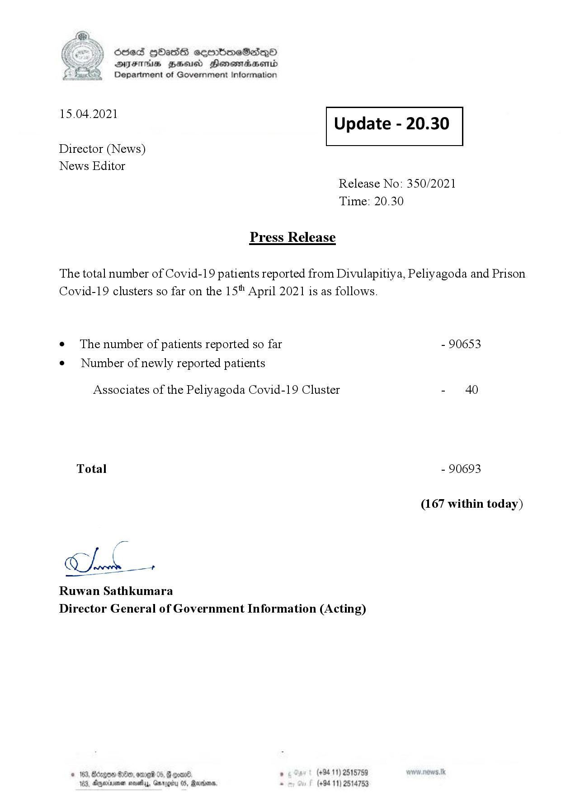

# Press Release - 2021.04.15 
Key: acbd6f6b280195ee4fd49d53cdc531ed 

---
```
\) O63 GOadS ceortimeSzdQO
AIFS BHU Henewmadasentd
Department of Government Information

 

 

15.04.2021 Update - 20.30

 

 

 

Director (News)

News Editor
Release No: 350/2021
Time: 20.30

Press Release

The total number of Covid-19 patients reported from Divulapitiya, Peliyagoda and Prison
Covid-19 clusters so far on the 15" April 2021 is as follows.

e The number of patients reported so far - 90653

¢ Number of newly reported patients

Associates of the Peliyagoda Covid-19 Cluster - 40
Total - 90693
(167 within today)

Chk

Ruwan Sathkumara
Director General of Government Information (Acting)

* 163 rg 06, 6 ’ (+94 11) 2515759
103, Ageinenen mosey, Gmragiiy 05, Martone . (+94 11) 2514753

 

```
