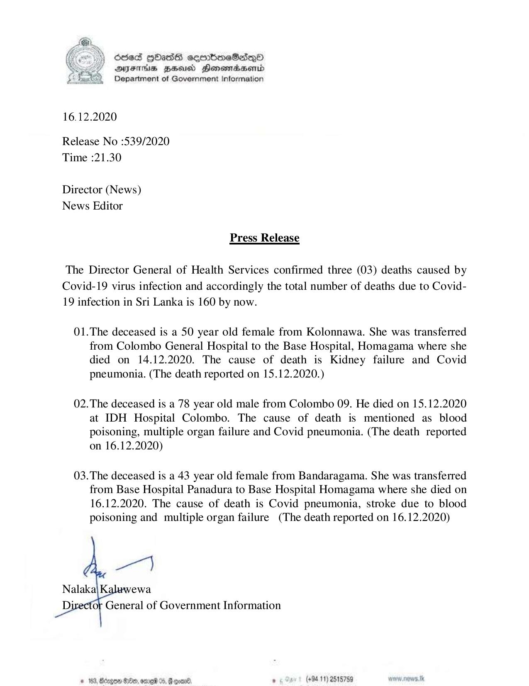

# Press Release - 2020.12.16 - 03  Covid 19 infection deaths has been reported , total deaths rises to 160 
Key: acd28fe3ae9ae6f49b5d3607481cafac 

---
```
6563 HOHasG sembmcSasqQo
DAFITAs BHU Honomrdbsernid
Department of Government Information

 

16.12.2020

Release No :539/2020
Time :21.30

Director (News)
News Editor

Press Release

The Director General of Health Services confirmed three (03) deaths caused by
Covid-19 virus infection and accordingly the total number of deaths due to Covid-
19 infection in Sri Lanka is 160 by now.

01.The deceased is a 50 year old female from Kolonnawa. She was transferred
from Colombo General Hospital to the Base Hospital, Homagama where she
died on 14.12.2020. The cause of death is Kidney failure and Covid
pneumonia. (The death reported on 15.12.2020.)

02.The deceased is a 78 year old male from Colombo 09. He died on 15.12.2020
at IDH Hospital Colombo. The cause of death is mentioned as blood
poisoning, multiple organ failure and Covid pneumonia. (The death reported

on 16.12.2020)

03.The deceased is a 43 year old female from Bandaragama. She was transferred
from Base Hospital Panadura to Base Hospital Homagama where she died on
16.12.2020. The cause of death is Covid pneumonia, stroke due to blood
poisoning and multiple organ failure (The death reported on 16.12.2020)

eer}

Nalaka\ Ke ewa
Di General of Government Information

(+84 11) 2515759

 

```
