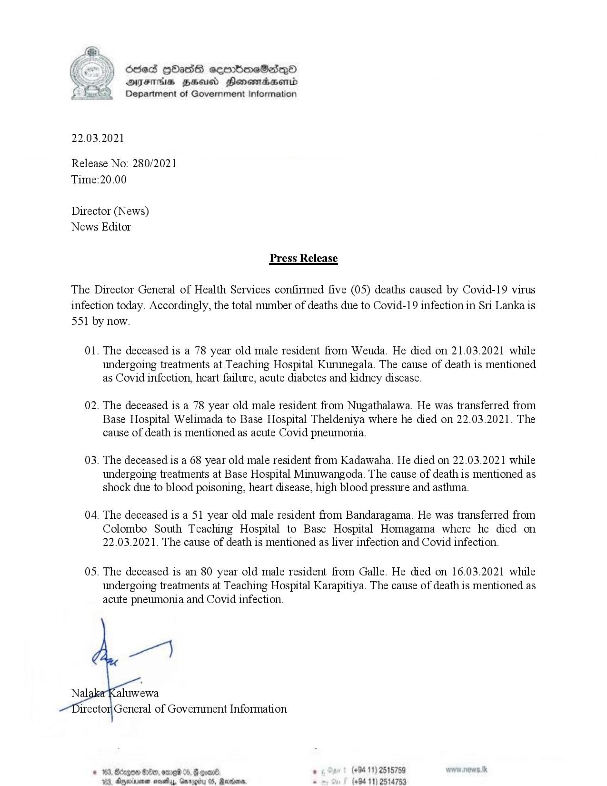

# Press Release - 2021.03.22 - Covid 19 infection deaths 
Key: acfc7ed3ceb31d2c8f61f9b627a0684f 

---
```
 

Sed HOHass semboneSaqQo
AIFS BHU Henewtaaentd
Department of Government Information

22.03.2021

Release No: 280/2021
Time:20.00

Director (News)
News Editor

Press Release

The Director General of Health Services confirmed five (05) deaths caused by Covid-19 virus
infection today. Accordingly, the total number of deaths due to Covid-19 infection in Sri Lanka is

S51

by now.

01. The deceased is a 78 year old male resident from Weuda. He died on 21.03.2021 while

undergoing treatments at Teaching Hospital Kurunegala. The cause of death is mentioned
as Covid infection, heart failure, acute diabetes and kidney disease.

02. The deceased is a 78 year old male resident from Nugathalawa. He was transferred from

Base Hospital Welimada to Base Hospital Theldentya where he died on 22.03.2021. The
cause of death is mentioned as acute Covid pneumonia.

03. The deceased is a 68 year old male resident from Kadawaha. He died on 22.03.2021 while

undergoing treatments at Base Hospital Minuwangoda. The cause of death is mentioned as
shock due to blood poisoning, heart disease, high blood pressure and asthma.

04. The deceased is a 51 year old male resident from Bandaragama. He was transferred from

Colombo South Teaching Hospital to Base Hospital Homagama where he died on
22.03.2021. The cause of death is mentioned as liver infection and Covid infection.

05. The deceased is an 80 year old male resident from Galle. He died on 16.03.2021 while

   

undergoing treatments at Teaching Hospital Karapitiya. The cause of death is mentioned as
acute pneumonia and Covid infection.

rector General of Government Information.

© 163, Bdrgon He, ome 05, G goad, (+94 19) 2515759
188, Amexraime sevethy, Gmrogity OS, Reena. s (+94 11) 53

 

```
