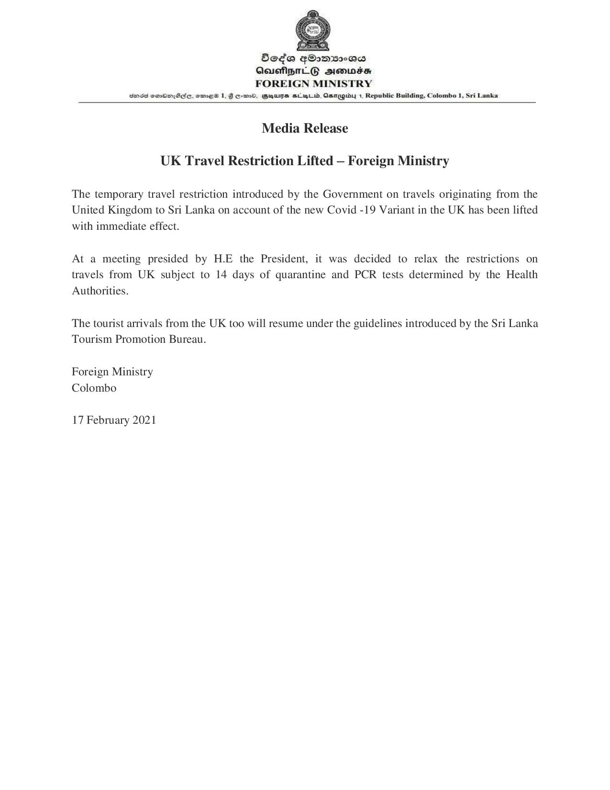

# Press Release - 2021.02.17 - UK Travel Restriction Lifted - Foreign Ministry 
Key: ade51dda970f1881648e2c73bf762c12 

---
```
 

 

BSeda q®omx2as
QeuehpnlEG simwss
FOREIGN MINISTRY

BOSE COODAEC, emES 1, GHD, GUTS SL gL, AsmagwY 1, Republic Building, Colombo 1, Sri Lanka

 

Media Release
UK Travel Restriction Lifted — Foreign Ministry
The temporary travel restriction introduced by the Government on travels originating from the
United Kingdom to Sri Lanka on account of the new Covid -19 Variant in the UK has been lifted
with immediate effect.
At a meeting presided by H.E the President, it was decided to relax the restrictions on
travels from UK subject to 14 days of quarantine and PCR tests determined by the Health

Authorities.

The tourist arrivals from the UK too will resume under the guidelines introduced by the Sri Lanka
Tourism Promotion Bureau.

Foreign Ministry
Colombo

17 February 2021

```
