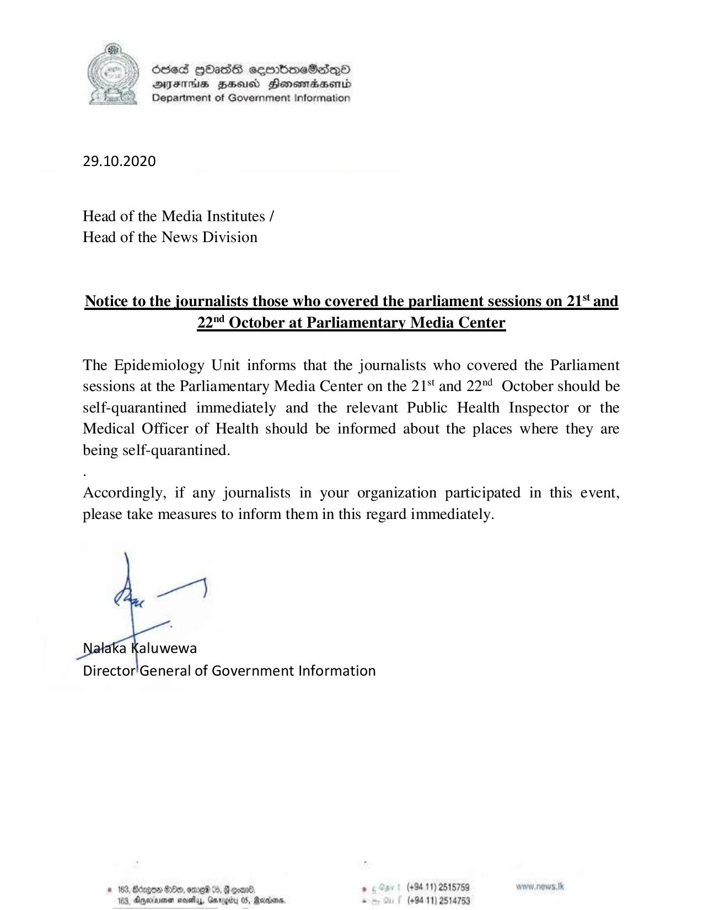

# Press Release - 2020.10.29 -To  Head of the Media Institutes 
Key: aeac07f456bd55e72c44d4e922a46605 

---
```
 

6565 HOAs soembmraeSasqoO
DFAS HEU Honenrdaserntd
Department of Government Information

 

29.10.2020

Head of the Media Institutes /
Head of the News Division

Notice to the journalists those who covered the parliament sessions on 21% and
22"¢ October at Parliamentary Media Center

The Epidemiology Unit informs that the journalists who covered the Parliament
sessions at the Parliamentary Media Center on the 21*' and 22™ October should be
self-quarantined immediately and the relevant Public Health Inspector or the
Medical Officer of Health should be informed about the places where they are
being self-quarantined.

Accordingly, if any journalists in your organization participated in this event,
please take measures to inform them in this regard immediately.

    

‘a Kaluwewa
Director'General of Government Information

, (+94 11) 2515759 ws.tk
(+94 11) 2514753

© 163, Bergen Oe, ome 0,
103, Anjwinrener ese, Gar

 

```
