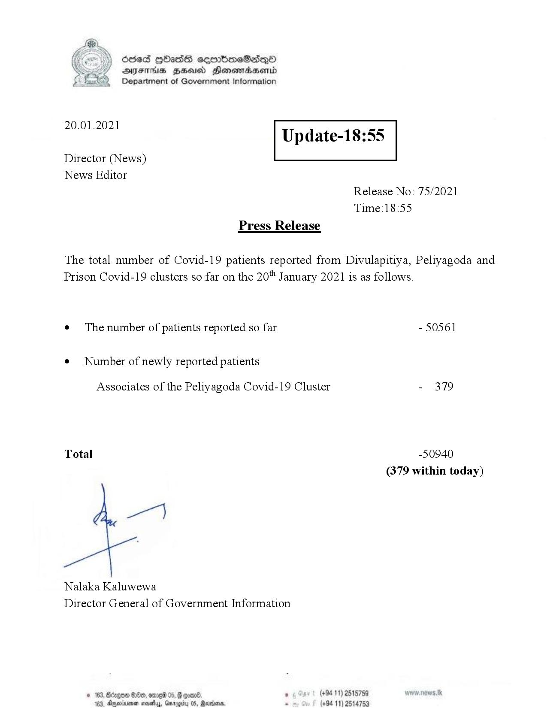

# Press Release - 2021.01.20 
Key: afddc1d2854a7850066ddba6f0cc1df1 

---
```
Ssed HbasG sembmeSadqo
DAIS BHU Honomasentd
Department of Government Information

 

 

20.01.2021

Update-18:55

 

 

 

Director (News)
News Editor
Release No: 75/2021
Time:18:55
Press Release

The total number of Covid-19 patients reported from Divulapitiya, Peliyagoda and
Prison Covid-19 clusters so far on the 20" January 2021 is as follows.
e¢ The number of patients reported so far - 50561

¢ Number of newly reported patients

Associates of the Peliyagoda Covid-19 Cluster - 379

Total -50940

(379 within today)

Nalaka Kaluwewa
Director General of Government Information

  

© 163, Bécge0 GO, ome 05, Be ° (+9411) 2515759
104, Ageiume sayy, Garogéu 0S, Rare. ps (+94 11) 2514753

```
