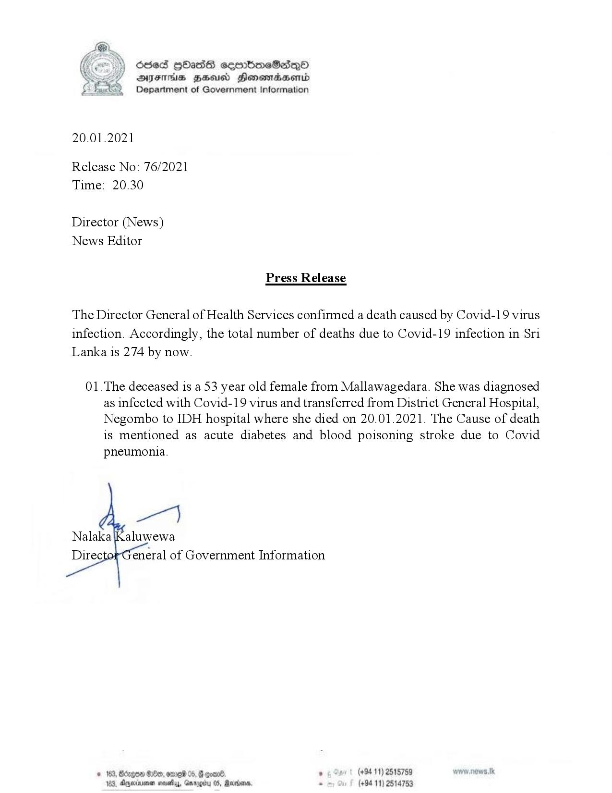

# Press Release - 2021.01.20 -Total covid 19 infection deaths rises to 274 
Key: afdf0779da3cc1e5553fe1f63f12907b 

---
```
6sed HHasG cseembmeSedqoO
AIFS BHU Honentadaerntd
Department of Government Information

 

20.01.2021

Release No: 76/2021
Time: 20.30

Director (News)
News Editor

Press Release

The Director General of Health Services confirmed a death caused by Covid-19 virus
infection. Accordingly, the total number of deaths due to Covid-19 infection in Sri
Lanka is 274 by now.

01.The deceased is a 53 year old female from Mallawagedara. She was diagnosed
as infected with Covid-19 virus and transferred from District General Hospital,
Negombo to IDH hospital where she died on 20.01.2021. The Cause of death
is mentioned as acute diabetes and blood poisoning stroke due to Covid
pneumonia.

 

 
 
 

Oe, ome 05, F ooar® ° (+94 11) 2515759 www.nows.tk
4, Ayoriniomen saves, Gmrogiby 0S, Rardin, . (+94 11) 2514753

```
