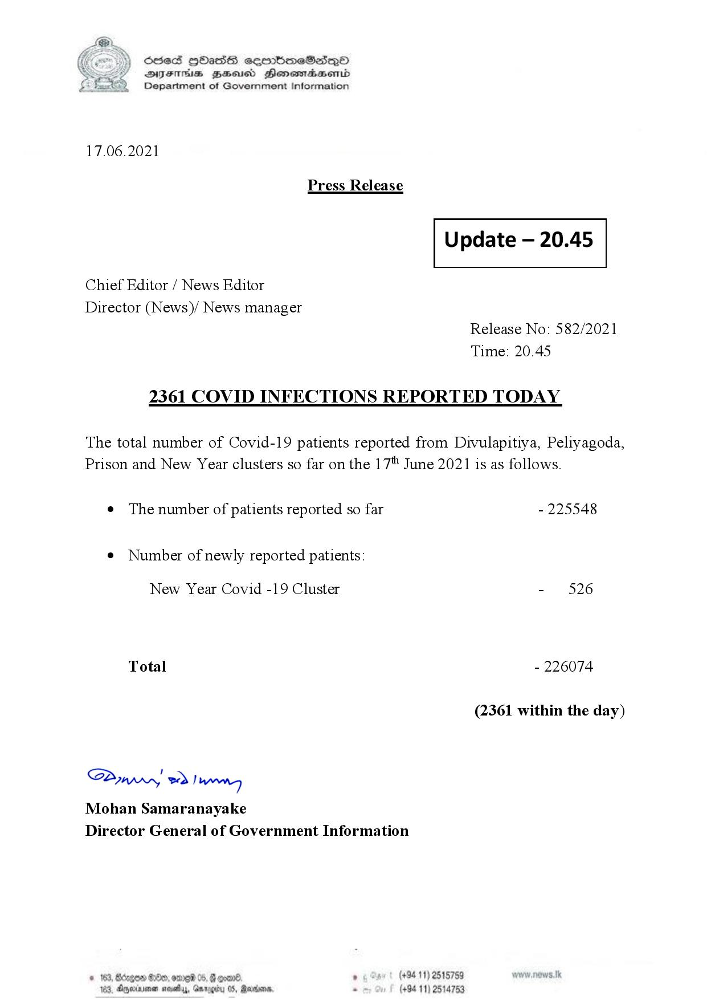

# Press Release - 2021.06.17 - Covid 19 infection report 
Key: b034921421ff274c3131b1444f66c435 

---
```
(6 S) ScseS HOasdS cerrbmeSdQo
DFTs BHEosd Henewtaeasernid
Department of Government Information

 

17.06.2021

Press Release

 

Update — 20.45

 

 

 

Chief Editor / News Editor

Director (News)/ News manager
Release No: 582/2021

Time: 20.45
2361 COVID INFECTIONS REPORTED TODAY

The total number of Covid-19 patients reported from Divulapitiya, Peliyagoda,
Prison and New Year clusters so far on the 17" June 2021 is as follows.

e The number of patients reported so far - 225548

¢ Number of newly reported patients:

New Year Covid -19 Cluster - 526

Total - 226074

(2361 within the day)

Saw 2) won,
Mohan Samaranayake
Director General of Government Information

© 163, Bdegon G80, ome 0 6 ’ (+94 11) 2515759
163, Agere naethy, Gmrogiby 05, Rereisons, - (+94 11) 2514753

 

```
