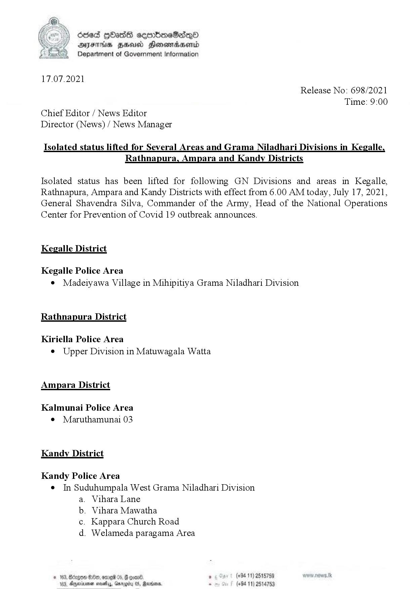

# Press Release - 2021.07.17 - Isolated status lifted Areas 
Key: b0b7c4ac22f20160fed2b4f4f2071391 

---
```
Oded [Hass ceerboeSadQd
DAFT HSU Honowadaenrd
Department of Government Information

 

17.07.2021
Release No: 698/2021
Time: 9:00
Chief Editor / News Editor
Director (News) / News Manager

Isolated status lifted for Several Areas and Grama Niladhari Divisions in Kegalle,
Rathnapura, Ampara and Kandy Districts

Isolated status has been lifted for following GN Divisions and areas in Kegalle,
Rathnapura, Ampara and Kandy Districts with effect from 6.00 AM today, July 17, 2021,
General Shavendra Silva, Commander of the Army, Head of the National Operations
Center for Prevention of Covid 19 outbreak announces.

Kegalle District

Kegalle Police Area
© Madeiyawa Village in Mihipitiya Grama Niladhari Division

Rathnapura District

Kiriella Police Area
© Upper Division in Matuwagala Watta

Ampara District

Kalmunai Police Area
e Maruthamunai 03

Kandy District

Kandy Police Area
¢ In Suduhumpala West Grama Niladhari Division
a. Vihara Lane
b. Vihara Mawatha
c. Kappara Church Road
d. Welameda paragama Area

Kongo @De0, orrei 05, @ quand ° (+94 11) 2515759
ernionen seve, Gmrggriry OS, Martians, . (+94 11) 2

 
    

```
