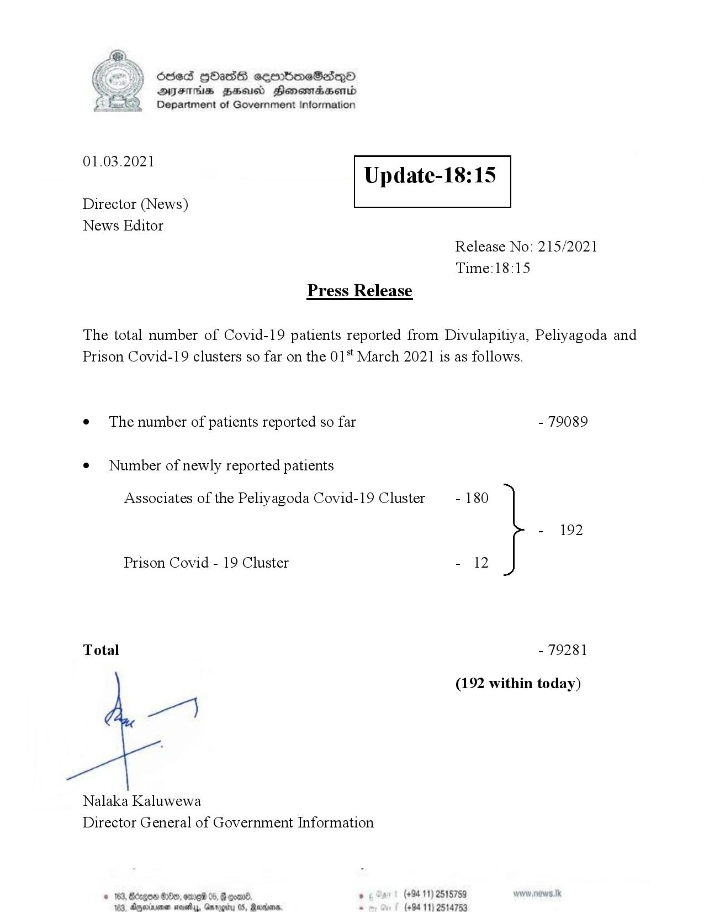

# Press Release - 2021.03.01 
Key: b1483f74fd9d692a0e1657827886980d 

---
```
>) Sed HOadS ceorbmeSedeQ®
DAIS BHU Honomasentd
Department of Government Information

 

 

01.03.2021

Update-18:15

 

 

 

Director (News)
News Editor
Release No: 215/2021
Time:18:15
Press Release

The total number of Covid-19 patients reported from Divulapitiya, Peliyagoda and
Prison Covid-19 clusters so far on the 01" March 2021 is as follows.
e¢ The number of patients reported so far - 79089

¢ Number of newly reported patients

Associates of the Peliyagoda Covid-19 Cluster - 180

- 192
Prison Covid - 19 Cluster - 12
Total - 79281
(192 within today)

ey

Nalaka Kaluwewa
Director General of Government Information

. (+94 11) 2515789
(+94 11) 2514753

 

```
