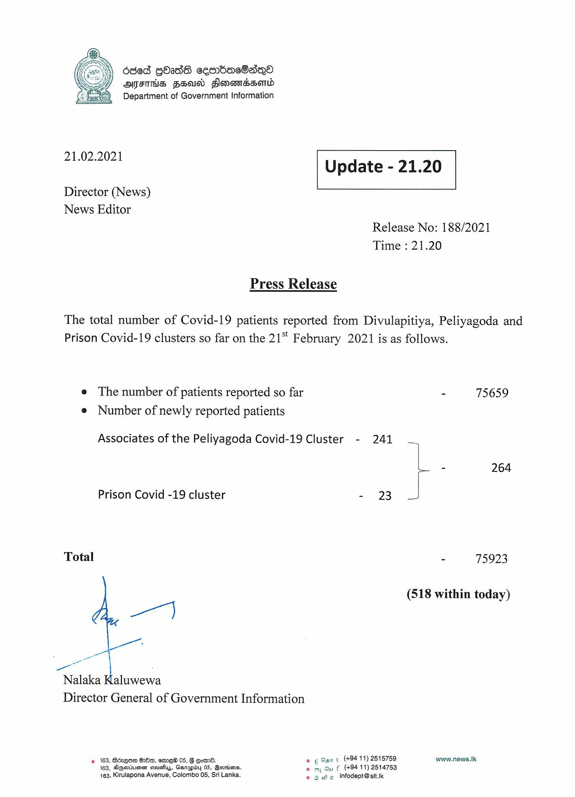

# Press Release - 2021.02.21 
Key: b19b3c11bae15020f3c19e7662c3d652 

---
```
686d GOS cesrbdbacOaqQo
AMFTHS FSD Slonomdsomd

 

 

21.02.2021 Update - 21.20

 

 

 

Director (News)

News Editor
Release No: 188/2021
Time : 21.20

Press Release

The total number of Covid-19 patients reported from Divulapitiya, Peliyagoda and
Prison Covid-19 clusters so far on the 21" February 2021 is as follows.

e The number of patients reported so far - 75659
e Number of newly reported patients

Associates of the Peliyagoda Covid-19 Cluster - 241

“|
i - 264
Prison Covid -19 cluster - 23
Total - 75923
(518 within today)

we}

“Nalaka K
Nalaka Kaluwewa

Director General of Government Information

2 163, Béreow Oo, emre® 05, § Gorm. © ¢ Osi t (+94 11) 2515759 www.news.k
163, Zigevinieen siovesiys, Garepby 05, Beorisenss eo my Qu f (+9411) 2514753
463, Kirulapona Avenue, Colombo 06, Sri Lanka. © 3 We infodept@sit.ik

```
