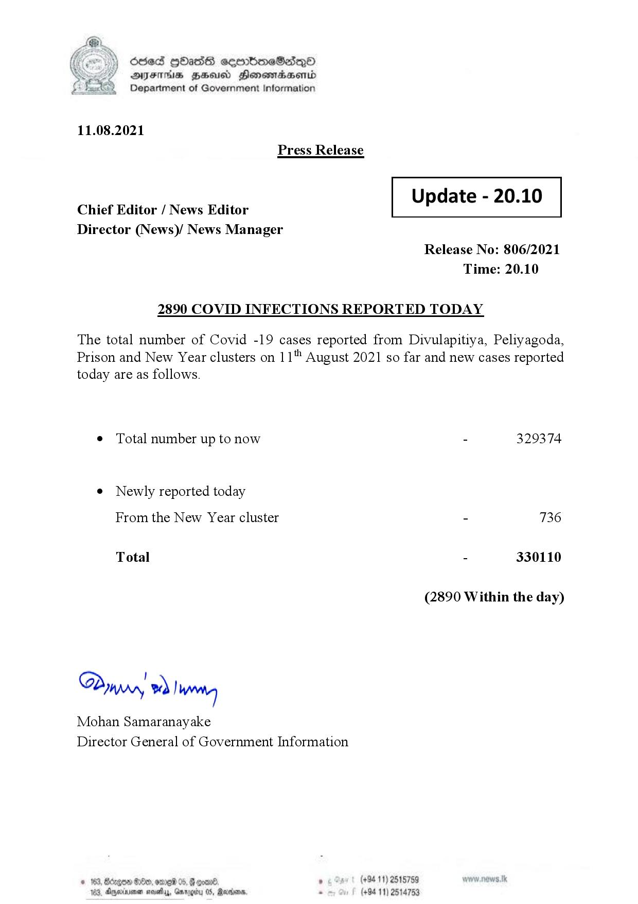

# Press Release - 2021.08.11 - Covid 19 Infection Report 
Key: b23868b92d947b685de22cdae737440d 

---
```
) Sled HOAsdS ceorbmeSdQo
DFS HHS Hensrradaentd
Department of Government Information

 

11.08.2021
Press Release

 

Update - 20.10

 

 

Chief Editor / News Editor
Director (News)/ News Manager

 

Release No: 806/2021
Time: 20.10

2890 COVID INFECTIONS REPORTED TODAY

The total number of Covid -19 cases reported from Divulapitiya, Peliyagoda,
Prison and New Year clusters on 11" August 2021 so far and new cases reported
today are as follows.

¢ Total number up to now - 329374

e Newly reported today

From the New Year cluster - 736
Total - 330110
(2890 Within the day)

I
Dypry wd) wna
Mohan Samaranayake
Director General of Government Information

med > 08, , (+94 11) 2515759
44, Garogiby 05, Revedans, . (+94 11) 2514753

 

```
