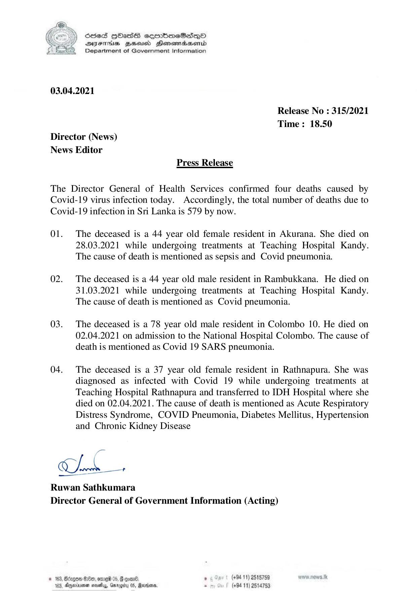

# Press Release - 2021.04.03 - Covid 19 infection deaths 
Key: b26aa31798012a545ed3abde1f32fb01 

---
```
NY Scdes HhasS coorbmeSedqQoO
DFTs BHEosd Henewtaeasernid
Department of Government Information

 

03.04.2021

Release No : 315/2021
Time: 18.50
Director (News)
News Editor
Press Release

The Director General of Health Services confirmed four deaths caused by
Covid-19 virus infection today. Accordingly, the total number of deaths due to
Covid-19 infection in Sri Lanka is 579 by now.

01. The deceased is a 44 year old female resident in Akurana. She died on
28.03.2021 while undergoing treatments at Teaching Hospital Kandy.
The cause of death is mentioned as sepsis and Covid pneumonia.

02. The deceased is a 44 year old male resident in Rambukkana. He died on
31.03.2021 while undergoing treatments at Teaching Hospital Kandy.
The cause of death is mentioned as Covid pneumonia.

03. The deceased is a 78 year old male resident in Colombo 10. He died on
02.04.2021 on admission to the National Hospital Colombo. The cause of
death is mentioned as Covid 19 SARS pneumonia.

04. The deceased is a 37 year old female resident in Rathnapura. She was
diagnosed as infected with Covid 19 while undergoing treatments at
Teaching Hospital Rathnapura and transferred to IDH Hospital where she
died on 02.04.2021. The cause of death is mentioned as Acute Respiratory
Distress Syndrome, COVID Pneumonia, Diabetes Mellitus, Hypertension
and Chronic Kidney Disease

ge

ne

 

Ruwan Sathkumara
Director General of Government Information (Acting)

© 163, Bdegoe B80, ore 05, @ goa. , (+84 19) 2515789
163, Aqernoner nasty, Garey 0S, Rarians - (+94 11) 2514753

```
