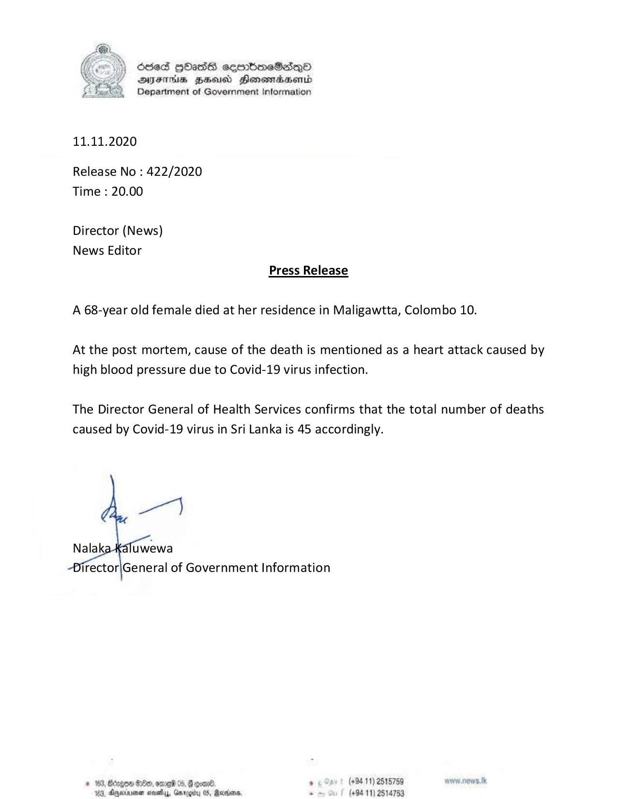

# Press Release - 2020.11.11 -  The 45th Covid 19 infection death has been reported 
Key: b2ad8a610caf0f24962c36158243d66f 

---
```
6563 HOHasG sembmcSasqQo
DFTs BHsusd HensmasABentd
Department of Government Information

 

11.11.2020

Release No : 422/2020
Time : 20.00

Director (News)
News Editor
Press Release

A 68-year old female died at her residence in Maligawtta, Colombo 10.

At the post mortem, cause of the death is mentioned as a heart attack caused by
high blood pressure due to Covid-19 virus infection.

The Director General of Health Services confirms that the total number of deaths
caused by Covid-19 virus in Sri Lanka is 45 accordingly.

   

irector|General of Government Information

# 183, Benge 80x, ome 0, Geoan®. . (494.11) 2515759 www. news. tk
163, Anwiaenen novey, Gmrogiby 0S, Rerians. “ (494.11) 2514753

```
