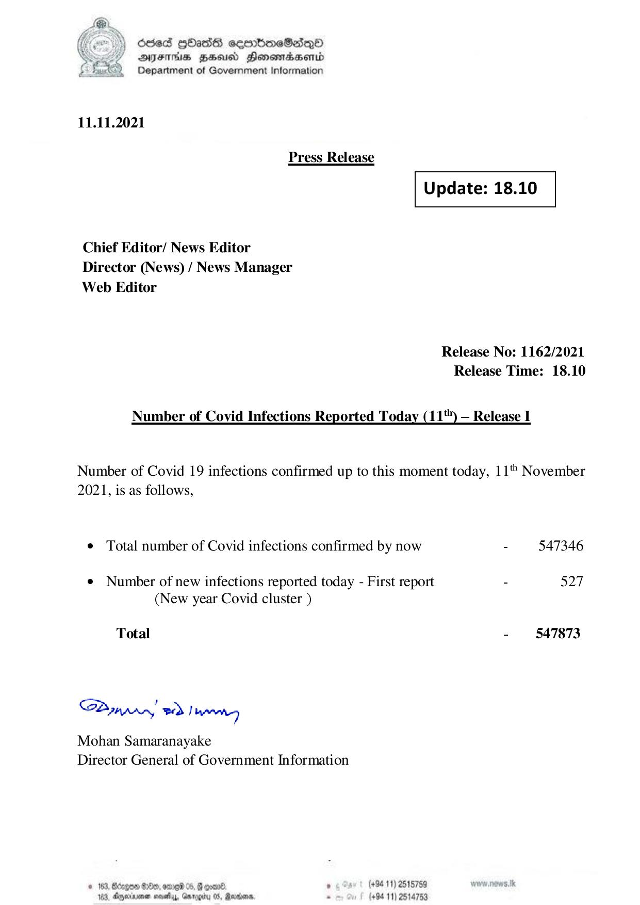

# Press Release - 2021.11.11 
Key: b2d72f8ea837aa79ee6bdf75e775caa1 

---
```
) dcded QOadS seenBboeSiqQo
AIFS HHUCO Honemadaenrd
Department of Government Information

 

11.11.2021

Press Release

 

 

Update: 18.10

 

 

Chief Editor/ News Editor
Director (News) / News Manager
Web Editor

Release No: 1162/2021
Release Time: 18.10

Number of Covid Infections Reported Today (11") — Release I

Number of Covid 19 infections confirmed up to this moment today, 11" November
2021, is as follows,

e Total number of Covid infections confirmed by now - 547346

¢ Number of new infections reported today - First report - 527
(New year Covid cluster )

Total - 547873

SPynpry wd! hawny

Mohan Samaranayake
Director General of Government Information

 

© 163, Bdzgoe $10, ome 05, @ gomn® , (+94 11) 2518759
163. Agywinmen sess, Gnroerty 05, arbors. . (+94 11) 2514753

```
