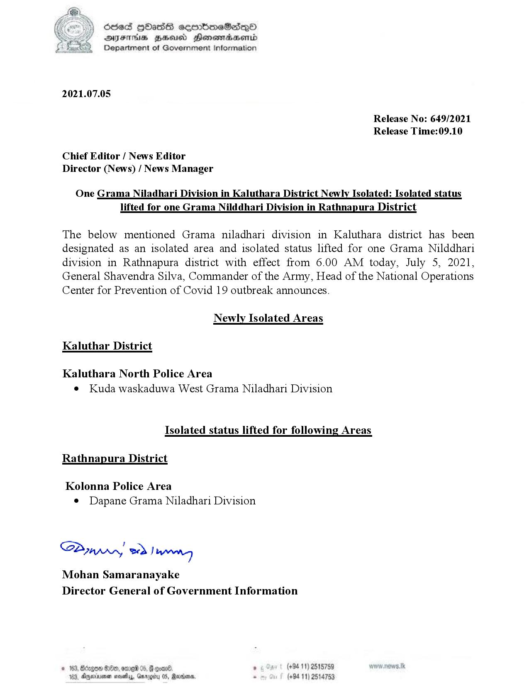

# Press Release - 2021.07.05 - Isolated lifting areas and newly isolated areas 
Key: b36d2d8f6ebee9daefbf45c25db4b804 

---
```
dosed Hbass sembmeSasqo
DFS HSE Honowradsenrd
Department of Government Information

 

2021.07.05

Release No: 649/2021
Release Time:09.10

Chief Editor / News Editor
Director (News) / News Manager

One Grama Niladhari Division in Kaluthara District Newly Isolated: Isolated status
lifted for one Grama Nilddhari Division in Rathnapura District

The below mentioned Grama niladhari division in Kaluthara district has been
designated as an isolated area and isolated status lifted for one Grama Nilddhari
division in Rathnapura district with effect from 6.00 AM today, July 5, 2021,
General Shavendra Silva, Commander of the Army, Head of the National Operations
Center for Prevention of Covid 19 outbreak announces.

Newly Isolated Areas
Kaluthar District
Kaluthara North Police Area

¢ Kuda waskaduwa West Grama Niladhari Division

Isolated status lifted for following Areas

Rathnapura District

Kolonna Police Area
e Dapane Grama Niladhari Division

SBirrny, 2d Irmo

Mohan Samaranayake
Director General of Government Information

(+94 11) 2515759
(+94 11) 2514753

 

```
