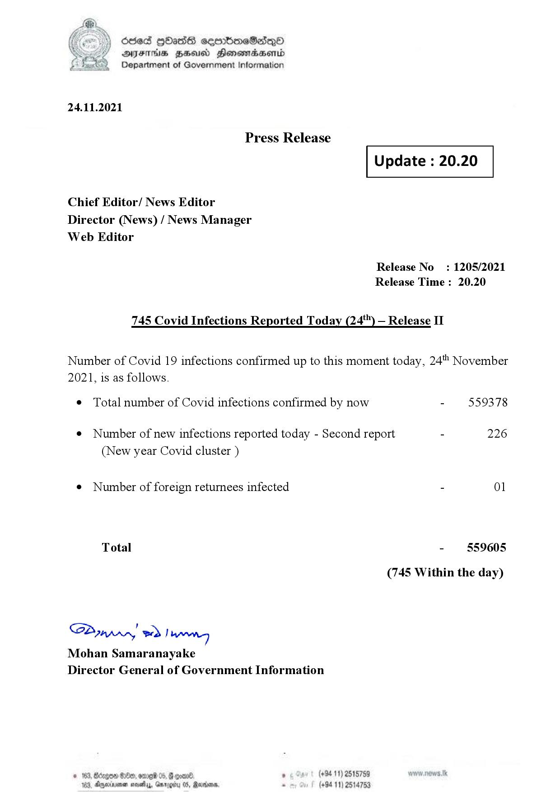

# Press Release - 2021.11.24 - Covid 19 Infection Report 
Key: b385ed34c2704e743c35d7cd35acf047 

---
```
dosed GOass eemmbmeSadepO
DFS BHU Honswnradasentd
Department of Government Information

 

 

24.11.2021

Press Release

Chief Editor/ News Editor
Director (News) / News Manager
Web Editor

 

 

Update : 20.20

 

 

Release No

: 1205/2021

Release Time : 20.20

745 Covid Infections Reported Today (24'") — Release II

Number of Covid 19 infections confirmed up to this moment today, 24 November

2021, is as follows.

¢ Total number of Covid infections confirmed by now

¢ Number of new infections reported today - Second report -

(New year Covid cluster )

¢ Number of foreign returnees infected

Total

SP nprrn wd Ianwng
Mohan Samaranayake
Director General of Government Information

GOD 100, omg 05
Doyerinsonen snevetyy, Garo

   

559378

226

01

559605

(745 Within the day)

(+94 11) 2515759
(+94 11) 2514753

```
