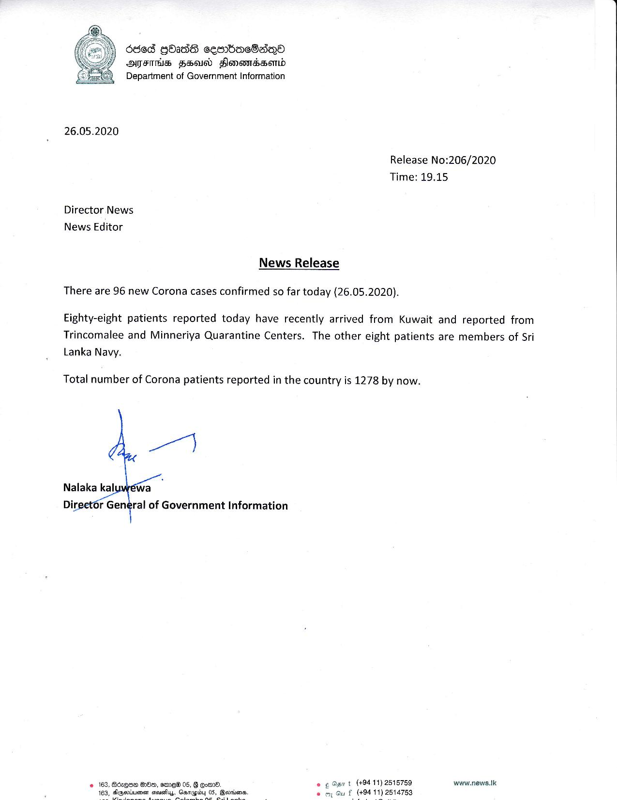

# Press Release - 2020.05.26 - 96 new corona cases confirmed today 
Key: b3fdeb067a32abbfd09cfb9a66680f10 

---
```
668 GOIdS ceembacSaqQo
AIFS HEU FHlonomadsomd
Department of Government information

 

26.05.2020

Release No:206/2020
Time: 19.15

Director News
News Editor

News Release

 

There are 96 new Corona cases confirmed so far today (26.05.2020).

Eighty-eight patients reported today have recently arrived from Kuwait and reported from
Trincomalee and Minneriya Quarantine Centers. The other eight patients are members of Sri
Lanka Navy.

Total number of Corona patients reported in the country is 1278 by now.

 

wrt (+94 11) 2515789 www.news.tk
£ (494 11) 2514753

 

© 162, Bdeqee G82, aime 05, & oemd.
of

   

```
