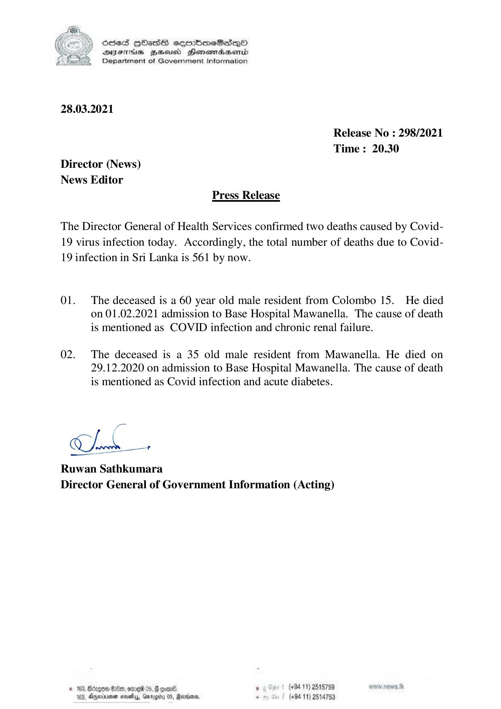

# Press Release - 2021.03.28 - Covid 19 infection deaths 
Key: b3fefb1f0a105a8cf0ad6b1ebfaae098 

---
```
NY Scdes HhasS coorbmeSedqQoO
See DEFIHS BHousd Honowmaasenid
£_S22)_ Department of Government Information

 

 

28.03.2021

Release No : 298/2021
Time: 20.30
Director (News)
News Editor
Press Release

The Director General of Health Services confirmed two deaths caused by Covid-
19 virus infection today. Accordingly, the total number of deaths due to Covid-
19 infection in Sri Lanka is 561 by now.

01. The deceased is a 60 year old male resident from Colombo 15. He died
on 01.02.2021 admission to Base Hospital Mawanella. The cause of death
is mentioned as COVID infection and chronic renal failure.

02. The deceased is a 35 old male resident from Mawanella. He died on
29.12.2020 on admission to Base Hospital Mawanella. The cause of death
is mentioned as Covid infection and acute diabetes.

2s

Cheb

Ruwan Sathkumara
Director General of Government Information (Acting)

19 81040, omg 05, @ quan®. . (+94 11) 2515759
an west, Garagiy 0S, Races. - (+94 11) 2514753

 
 

```
