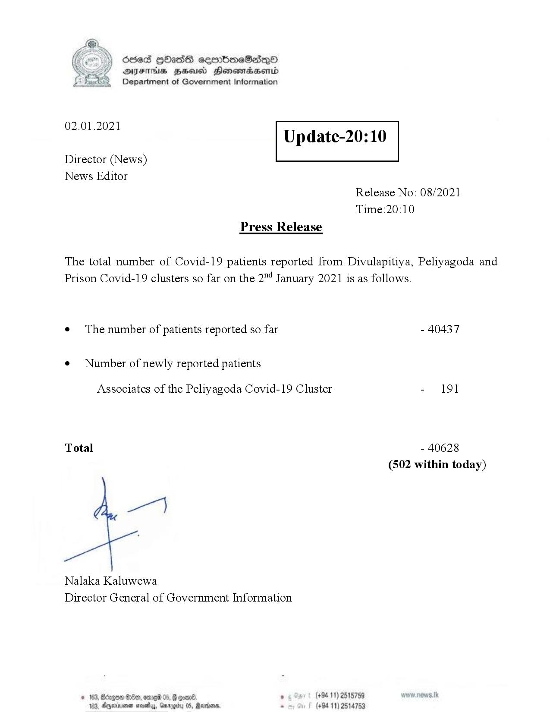

# Press Release - 2021.01.02 
Key: b40fa2023bbb39da05dd917efab00d13 

---
```
Ssed HbasG sembmeSadqo
DAIS BHU Honomasentd
Department of Government Information

 

 

02.01.2021

Update-20:10

 

 

 

Director (News)
News Editor
Release No: 08/2021
Time:20:10
Press Release

The total number of Covid-19 patients reported from Divulapitiya, Peliyagoda and
Prison Covid-19 clusters so far on the 2"4 January 2021 is as follows.

e¢ The number of patients reported so far - 40437

¢ Number of newly reported patients

Associates of the Peliyagoda Covid-19 Cluster - 191

Total - 40628
(502 within today)

Nalaka Kaluwewa
Director General of Government Information

© 163, Bciegoe G8, ore 05, @ coal , (+94 11) 2518759
163, Aperture neath, Garogiry 05, Ranma - (+94 11) 2514753

```
