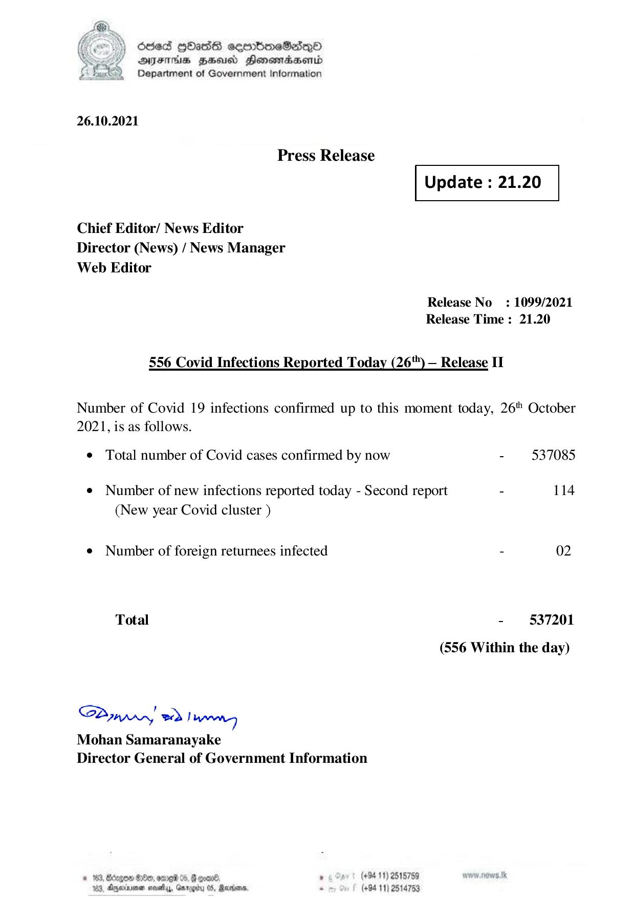

# Press Release - 2021.10.26 - Covid 19 Infection Report 
Key: b49541da013bf23a2156b826eeb42cbb 

---
```
) died Gass ceembeSsdqQo
DFS BHU Honswnradasentd
2 Department of Government Information

   

26.10.2021

Press Release

 

Update : 21.20

 

 

 

Chief Editor/ News Editor
Director (News) / News Manager
Web Editor

Release No: 1099/2021
Release Time : 21.20

556 Covid Infections Reported Today (26") — Release IT

Number of Covid 19 infections confirmed up to this moment today, 26" October
2021, is as follows.

¢ Total number of Covid cases confirmed by now - 537085
¢ Number of new infections reported today - Second report - 114
(New year Covid cluster )
¢ Number of foreign returnees infected - 02
Total - 537201
(556 Within the day)

Saar eed Joanng
Mohan Samaranayake
Director General of Government Information

© 163, Beizgoe S00, ore 05, # goane ° (#94 11) 2518789
163, Aparna seseiy, Gnrogiry 05, Ravens, - (+94 11) 2514753

```
