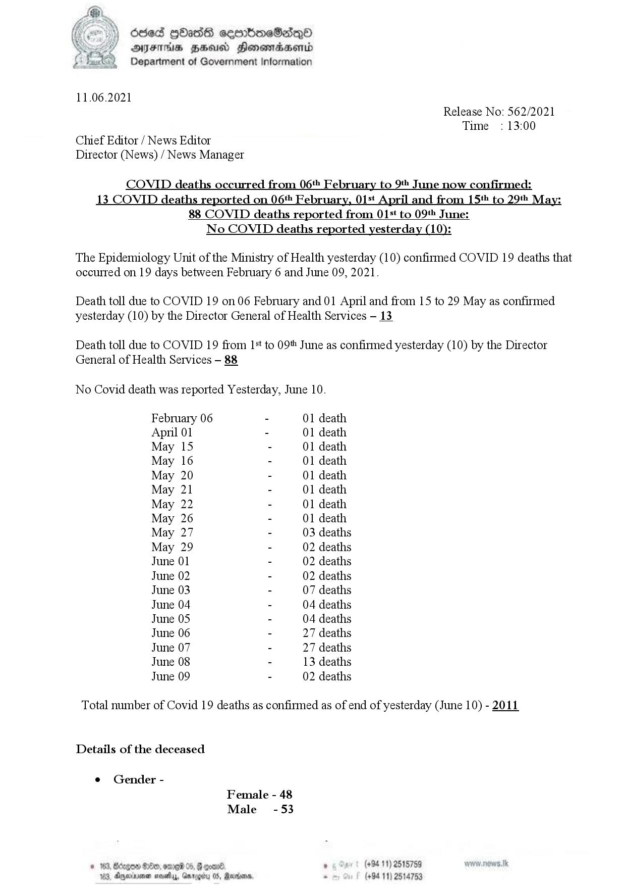

# Press Release - 2021.06.11 - Covid 19 infection deaths( yesterday) 
Key: b511cbd0fa6f16fbecdfaf476b47c991 

---
```
ode [bas cermboeSadQo®
AIFS HHU Honowadwenrd
Department of Government Information

 

11.06.2021
Release No: 562/2021
Time : 13:00
Chief Editor / News Editor
Director (News) / News Manager

COVID deaths occurred from 06 February to 9 June now confirmed:
13 COVID deaths reported on 06 February, 015 April and from 15‘ to 29tt May:

88 COVID deaths reported from 015t to 09» June:
No COVID deaths reported yesterday (10):

The Epidemiology Unit of the Ministry of Health yesterday (10) confirmed COVID 19 deaths that
occurred on 19 days between February 6 and June 09, 2021.

Death toll due to COVID 19 on 06 February and 01 April and from 15 to 29 May as confirmed
yesterday (10) by the Director General of Health Services - 13

Death toll due to COVID 19 from 1+ to 09 June as confirmed yesterday (10) by the Director
General of Health Services — 88

No Covid death was reported Yesterday, June 10.

February 06 - 01 death
April 01 - 01 death
May 15 - 01 death
May 16 - 01 death
May 20 - 01 death
May 21 - 01 death
May 22 - 01 death
May 26 - 01 death
May 27 - 03 deaths
May 29 - 02 deaths
June 01 - 02 deaths
June 02 - 02 deaths
June 03 - 07 deaths
June 04 - 04 deaths
June 05 - 04 deaths
June 06 - 27 deaths
June 07 - 27 deaths
June 08 - 13 deaths
June 09 - 02 deaths

Total number of Covid 19 deaths as confirmed as of end of yesterday (June 10) - 2011

Details of the deceased

¢ Gender -
Female - 48
Male -53

GHe . (+94 11) 2515759

Agena

    

```
