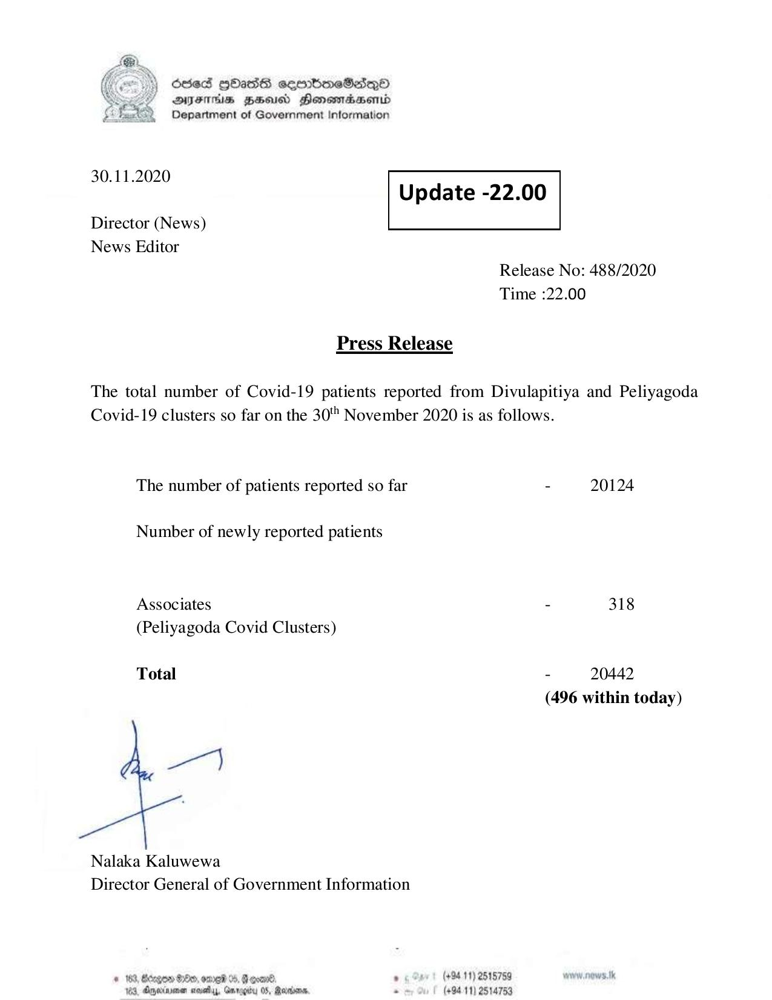

# Press Release - 2020.11.30 
Key: b532031dfef035461a616fcdace6b122 

---
```
6563 HOHasG sembmcSasqQo
DAJFITAs BHU Honomrdbsertd
Department of Government Information

 

 

30.11.2020
Update -22.00

 

 

Director (News)
News Editor

 

Release No: 488/2020
Time :22.00

Press Release
The total number of Covid-19 patients reported from Divulapitiya and Peliyagoda
Covid-19 clusters so far on the 30" November 2020 is as follows.
The number of patients reported so far - 20124
Number of newly reported patients
Associates - 318
(Peliyagoda Covid Clusters)

Total - 20442
(496 within today)

7}

Nalaka Kaluwewa
Director General of Government Information

* 163, Bcogon Ge, ome %, G goad . (+94 11) 2515759 ww. news. tk
123, Oneiarnen sovaby, Grrogity 05, Madan. . (+9411) 2514753

```
