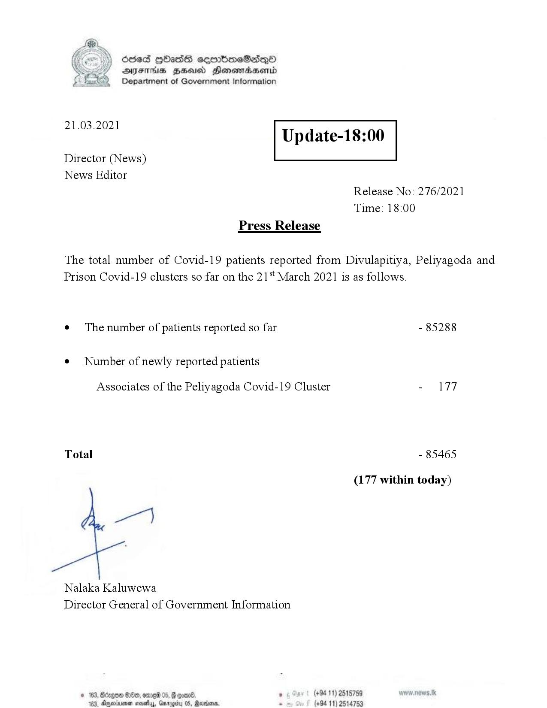

# Press Release - 2021.03.21 
Key: b5ef8795f8af226c4ceb0e48025d1b47 

---
```
Ssed HbasG sembmeSadqo
DAIS BHU Honomasentd
Department of Government Information

 

 

21.03.2021

Update-18:00

 

 

 

Director (News)
News Editor
Release No: 276/2021
Time: 18:00
Press Release

The total number of Covid-19 patients reported from Divulapitiya, Peliyagoda and
Prison Covid-19 clusters so far on the 21" March 2021 is as follows.
e¢ The number of patients reported so far - 85288

¢ Number of newly reported patients

Associates of the Peliyagoda Covid-19 Cluster - 177

Total - 85465

(177 within today)

per]

Nalaka Kaluwewa
Director General of Government Information

© 163, Bro 88, omg 05, oan ’ (+94 11) 2515789
183. Aerie nesta, Gmrogity 05, Rarer. s (+94 11) 2514753

```
