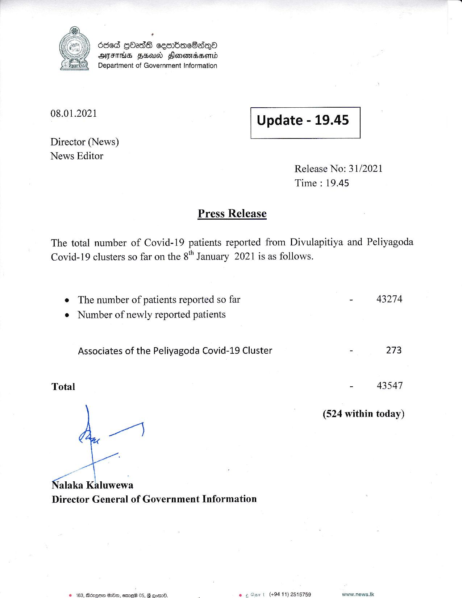

# Press Release - 2021.01.08 
Key: b654746e55bf40adb3abc2f43ac4d67d 

---
```
686d QOadS cecmbac8aqQo
AIMS FEU Slomemssond
Department of Government Information

 

 

08.01.2021 Update - 19.45

 

 

 

Director (News)

News Editor
Release No: 31/2021
Time : 19.45

Press Release

The total number of Covid-19 patients reported from Divulapitiya and Peliyagoda
Covid-19 clusters so far on the 8" January 2021 is as follows.

e The number of patients reported so far - 43274
e Number of newly reported patients

Associates of the Peliyagoda Covid-19 Cluster - 273

Total - 43547

(524 within today)

ir]

Nalaka Kaluwewa
Director General of Government Information

© 163, Bécque Ae, eme® 05, @ comm. - © earl (49411) 2515759 www.news.lk

```
