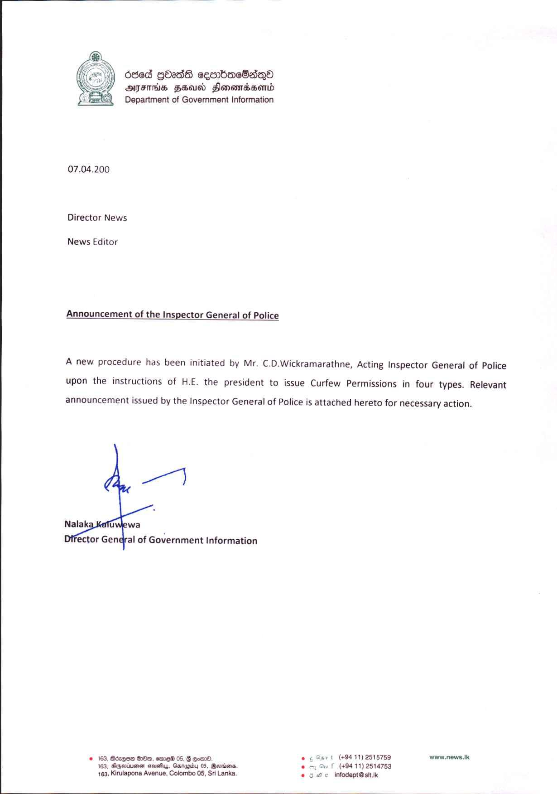

# 07.04.2020 - Formalizing the Issuance of Curfew Permits 
Key: b6d0447afca934eabf768acb46d86138 

---
```
 

6868 QbasdS cesrboareBaqQo
ATITHS FEU FlonowBssortd
Department of Government Information

 

07.04.200

Director News

News Editor

Announcement of the Inspector General of P.

A new procedure has been initiated by Mr. C.D.Wickramarathne, Acting Inspector General of Police
upon the instructions of H.E. the president to issue Curfew Permissions in four types. Relevant

announcement issued by the Inspector General of Police is attached hereto for necessary action.

   

‘ector Gendral of Government Information

 

. 5, Borgen On, ere 05, § como. . or | (49411) 2515759 www.news.Ik
63, Mgeiumen aevehy, Garapby 05, Rowena. . 2 f (+94 11) 2514753
pe Kirulapona Avenue, Colombo 05, Sri Lanka, «9H infodeptestt.k

 

```
