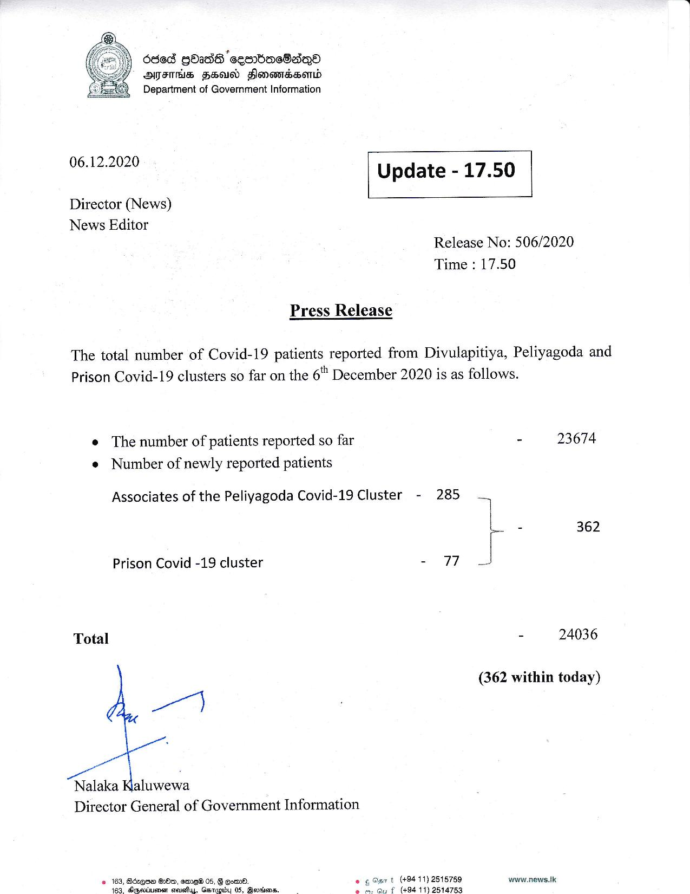

# Press Release - 2020.12.06 
Key: b7d2cd27dc4941f63bbf38a1a1ee2dfb 

---
```
6868 QOadS eentionsSadqo
OFTHE HEU Hlonewrdsemd
Department of Government Information

 

 

06.12.2020

 

Update - 17.50

 

 

Director (News)
News Editor

Release No: 506/2020
Time : 17.50

Press Release

The total number of Covid-19 patients reported from Divulapitiya, Peliyagoda and
Prison Covid-19 clusters so far on the 6" December 2020 is as follows.

e The number of patients reported so far
¢ Number of newly reported patients

Associates of the Peliyagoda Covid-19 Cluster - 285
Prison Covid -19 cluster - 77
Total
Nalaka Kaluwewa
Director General of Government Information
2 163, Bdzqne GOn, ame®@ 05, § eom®. . t (+8411) 2515759
163, Sepotusmen steustuy, Getapiby 05, Gevnins. e f (49411) 2514753

 

- 23674

4
r 2 362
- 24036

(362 within today)

www.news.ik

```
