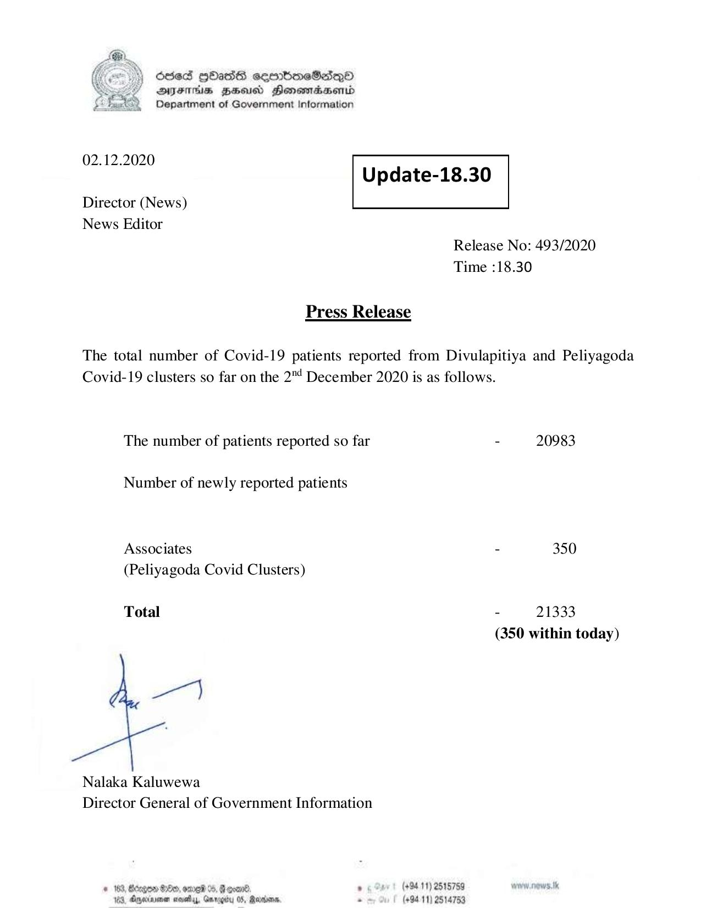

# Press Release - 2020.12.02 
Key: b805f7865a534b8bf7da9da338eab206 

---
```
6563 HOHasG sembmcSasqQo
DAJFITAs BHU Honomrdbsertd
Department of Government Information

 

 

02.12.2020
Update-18.30

 

 

Director (News)
News Editor

 

Release No: 493/2020
Time :18.30

Press Release
The total number of Covid-19 patients reported from Divulapitiya and Peliyagoda
Covid-19 clusters so far on the 2"! December 2020 is as follows.
The number of patients reported so far - 20983
Number of newly reported patients
Associates - 350
(Peliyagoda Covid Clusters)

Total - 21333
(350 within today)

7}

Nalaka Kaluwewa
Director General of Government Information

* 163, Bcogon Ge, ome %, G goad . (+94 11) 2515759 ww. news. tk
123, Oneiarnen sovaby, Grrogity 05, Madan. . (+9411) 2514753

```
