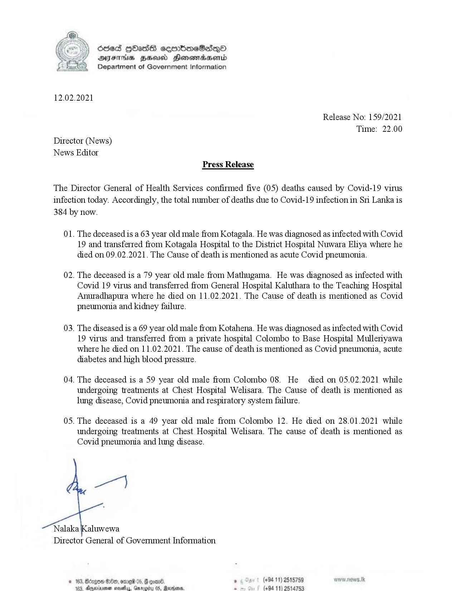

# Press Release - 2021.02.12 - Covid 19 infection deaths 
Key: b86271a06b1404a78d99cbb0b82d3fbf 

---
```
osed HOasG cembmeSadqoO
DAYFIHS FBS Honomasentd
Department of Government Information

 

12.02.2021

Release No: 159/2021
Time: 22.00
Director (News)
News Editor
Press Release

The Director General of Health Services confirmed five (05) deaths caused by Covid-19 virus
infection today. Accordingly, the total number of deaths due to Covid-19 infection in Sri Lanka is
384 by now.

01. The deceased is a 63 year old male from Kotagala. He was diagnosed as infected with Covid
19 and transferred from Kotagala Hospital to the District Hospital Nuwara Eliya where he
died on 09.02.2021. The Cause of death is mentioned as acute Covid pneumonia.

02. The deceased is a 79 year old male from Mathugama. He was diagnosed as infected with
Covid 19 virus and transferred from General Hospital Kaluthara to the Teaching Hospital
Anuradhapura where he died on 11.02.2021. The Cause of death is mentioned as Covid
pneumonia and kidney failure.

03. The diseased is a 69 year old male from Kotahena. He was diagnosed as infected with Covid
19 virus and transferred from a private hospital Colombo to Base Hospital Mulleriyawa
where he died on 11.02.2021. The cause of death is mentioned as Covid pneumonia, acute
diabetes and high blood pressure.

04. The deceased is a 59 year old male from Colombo 08. He died on 05.02.2021 while
undergoing treatments at Chest Hospital Welisara. The Cause of death is mentioned as
lung disease, Covid pneumonia and respiratory system failure.

05. The deceased is a 49 year old male from Colombo 12. He died on 28.01.2021 while

undergoing treatments at Chest Hospital Welisara. The cause of death is mentioned as
Covid pneumonia and lung disease.

we)

Nalaka Kaluwewa
Director General of Government Information

, (+94 11) 2515789
(494 11) 2514753

 
 
 

© 163, Bdcgon Oe, ome 05, # ¢
10% Gnectamen eudias, Gaeecd

```
