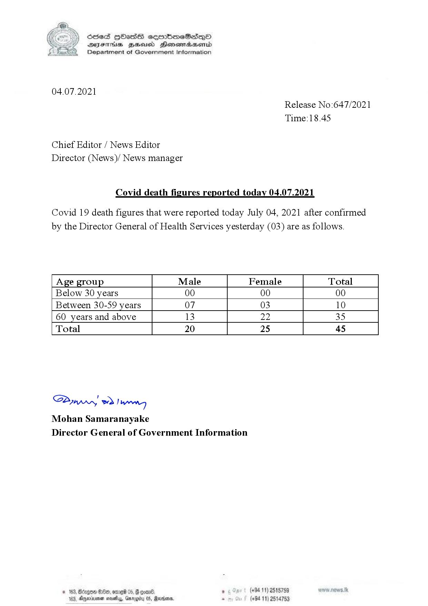

# Press Release - 2021.07.04 - Covid 19 infection deaths 
Key: b9b9968b341622faf63a2f6caf6e9cbc 

---
```
(6 ) dcsed HbHass cermbm~eSadeQo
S DIsFHsS BHsusd Henewmiaaentd
Department of Government Information

 

04.07.2021
Release No:647/2021
Time:18.45

Chief Editor / News Editor
Director (News)/ News manager

Covid death figures reported today 04.07.2021

Covid 19 death figures that were reported today July 04, 2021 after confirmed
by the Director General of Health Services yesterday (03) are as follows.

 

 

 

 

 

Age group Male Female Total
Below 30 years 00 00 00
Between 30-59 years 07 03 10
60 years and above 13 22 35
Total 20 25 45

 

 

 

 

 

 

SP od Ianwng
Mohan Samaranayake
Director General of Government Information

NED 0 06) . (+94 11) 2515759
44, Gargtty 05, Martone, . (+94 11) 2514753

   

3, Agerniean s

```
