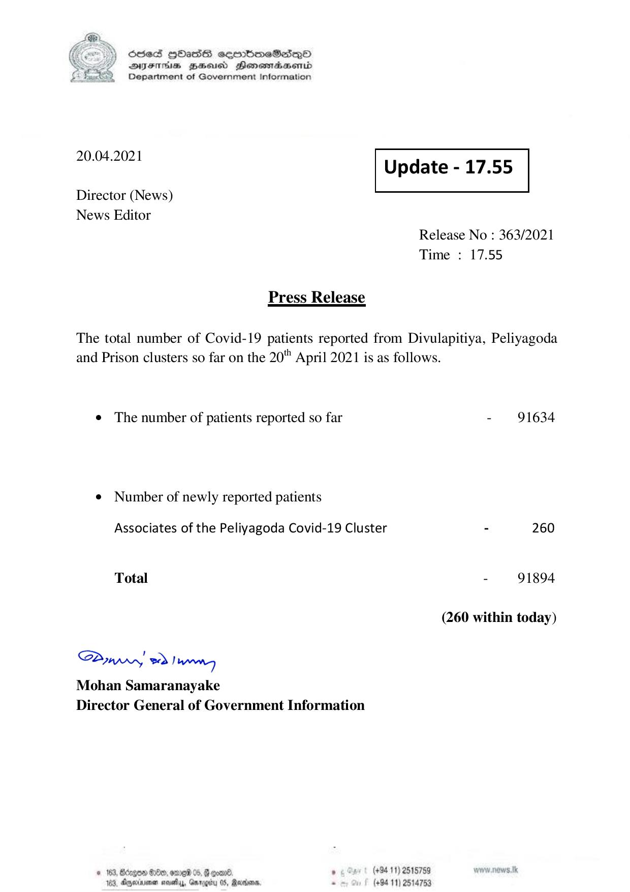

# Press Release - 2021.04.20 
Key: b9e483793f5cc379e1361a035c01c7d4 

---
```
) ScdeS HOadS cermbmeSsdQo
DVFIHS BHU Henewiaentd
Department of Government Information

 

 

20.04.2021 Update - 17.55

Director (News)
News Editor

 

 

 

Release No : 363/2021
Time : 17.55

Press Release
The total number of Covid-19 patients reported from Divulapitiya, Peliyagoda

and Prison clusters so far on the 20" April 2021 is as follows.

e The number of patients reported so far - 91634

¢ Number of newly reported patients

Associates of the Peliyagoda Covid-19 Cluster - 260
Total - 91894
(260 within today)

Saw eo) wenn
Mohan Samaranayake
Director General of Government Information

© 163, Bccgon 6:80, erg 05, @ even® ‘ (+94 11) 2518759
163, Ageia sesehy, Garogiy 05, Rare, - (+94 11) 2514753

```
