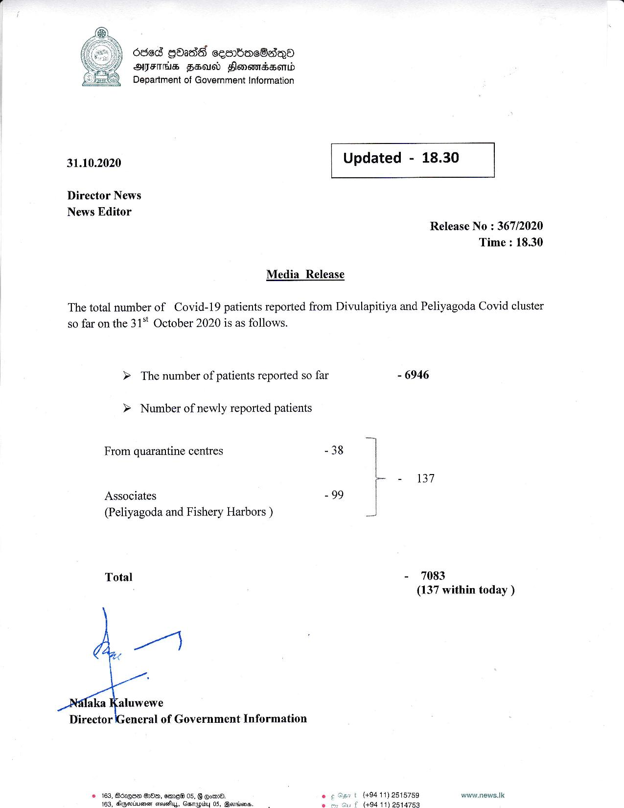

# Press Release - 2020.10.31 
Key: ba8f0920c4dfadf2f2d4bf27baed9120 

---
```
  

|) Ocsed GOadS ceenrbdreSadQo
ANYTIME HEU Hlonemadsord
Department of Government Information

 

31.10.2020 Updated - 18.30

 

 

 

Director News
News Editor
Release No : 367/2020
Time : 18.30
Media Release

The total number of Covid-19 patients reported from Divulapitiya and Peliyagoda Covid cluster
so far on the 31°" October 2020 is as follows.

> The number of patients reported so far - 6946

> Number of newly reported patients

From quarantine centres - 38
- 137
Associates -99 |
(Peliyagoda and Fishery Harbors ) a
Total - 7083
. (137 within today )

 

```
