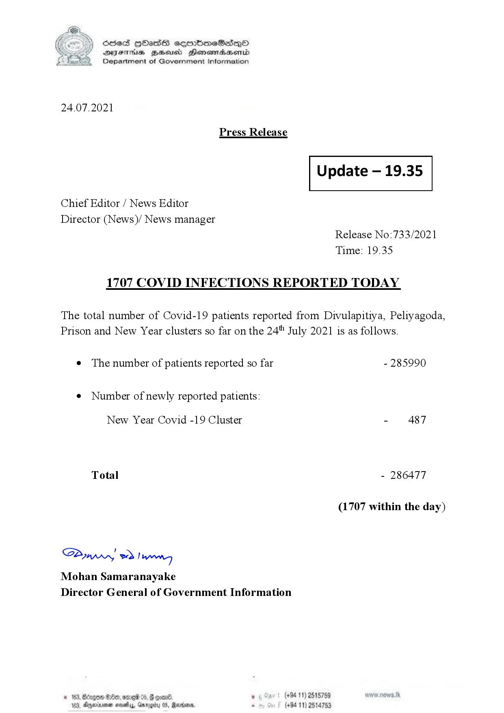

# Press Release - 2021.07.24 
Key: bb5c164aa53204e4bffd07cf3f21cea0 

---
```
(6 S) ScseS HOasdS cerrbmeSdQo
DFTs BHEosd Henewtaeasernid
Department of Government Information

 

24.07.2021

Press Release

 

Update — 19.35

 

 

 

Chief Editor / News Editor

Director (News)/ News manager
Release No:733/2021
Time: 19.35

1707 COVID INFECTIONS REPORTED TODAY

The total number of Covid-19 patients reported from Divulapitiya, Peliyagoda,
Prison and New Year clusters so far on the 24" July 2021 is as follows.

e The number of patients reported so far - 285990

¢ Number of newly reported patients:

New Year Covid -19 Cluster - 487
Total - 286477
(1707 within the day)

Saw 2) won,
Mohan Samaranayake
Director General of Government Information

© 163, Bdegon G80, ome 0 6 ’ (+94 11) 2515759
163, Agere naethy, Gmrogiby 05, Rereisons, - (+94 11) 2514753

 

```
