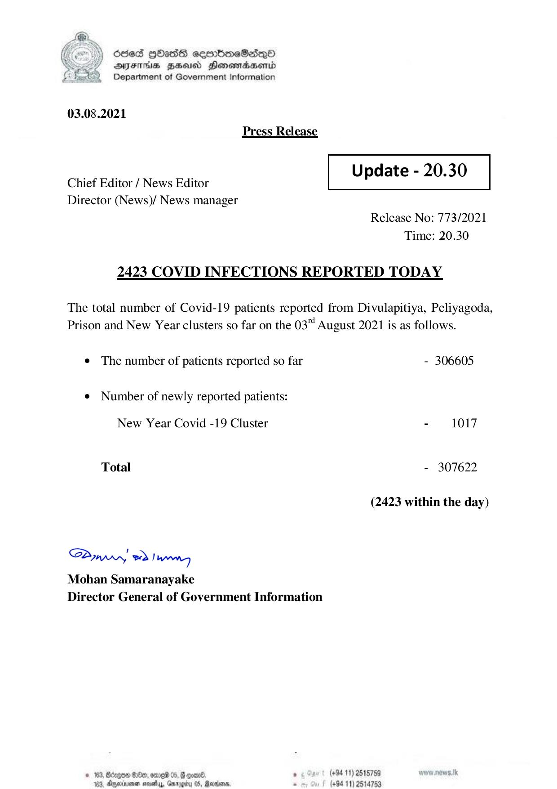

# Press Release - 2021.08.03 - Covid 19 Infection Report 
Key: bb91dce37cc4fe78d8bb7d928353e15d 

---
```
) Sled HOasdS cseorbKoeSdQo
DFIHS BHU Honsordaentd
Department of Government Information

 

03.08.2021
Press Release

 

Update - 20.30

 

 

Chief Editor / News Editor
Director (News)/ News manager

 

Release No: 773/2021
Time: 20.30

2423 COVID INFECTIONS REPORTED TODAY

The total number of Covid-19 patients reported from Divulapitiya, Peliyagoda,
Prison and New Year clusters so far on the 03" August 2021 is as follows.

e The number of patients reported so far - 306605
¢ Number of newly reported patients:

New Year Covid -19 Cluster - 1017

Total - 307622

(2423 within the day)

Sawwy 2) wry
Mohan Samaranayake
Director General of Government Information

 
 

10eo, emneld 08, @ qoa0®. . (+94 11) 2518759
163, Aner nae, Garogiy 05, Renda, x (+94 11) 2514753

```
