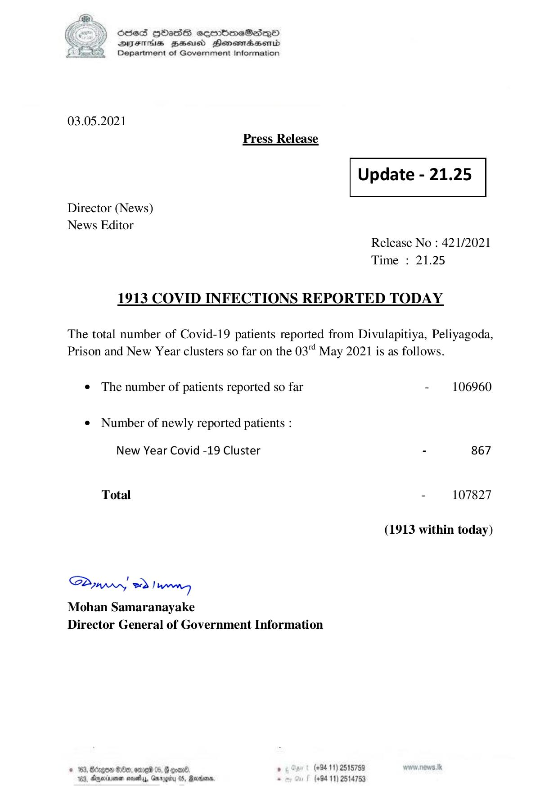

# Press Release - 2021.05.03 
Key: bc551c1c2d743dd385345604b2d58c93 

---
```
6856S HHass sermbmeSasqQo
DYSETHsS BRU Henesrsend
Department of Government Information

 

03.05.2021
Press Release

 

Update - 21.25

 

 

 

Director (News)
News Editor

Release No : 421/2021
Time : 21.25

1913 COVID INFECTIONS REPORTED TODAY

The total number of Covid-19 patients reported from Divulapitiya, Peliyagoda,
Prison and New Year clusters so far on the 03 May 2021 is as follows.

¢ The number of patients reported so far - 106960

¢ Number of newly reported patients :

New Year Covid -19 Cluster - 867
Total - 107827
(1913 within today)

Saw eo) wenn
Mohan Samaranayake
Director General of Government Information

© 163, Btzgen S10e0, ore 05, @ oan , (+94 11) 2515789
183, Aqerirsonen sasha, Garygity 05, Ravana. - (+84 11) 2514753

 

```
