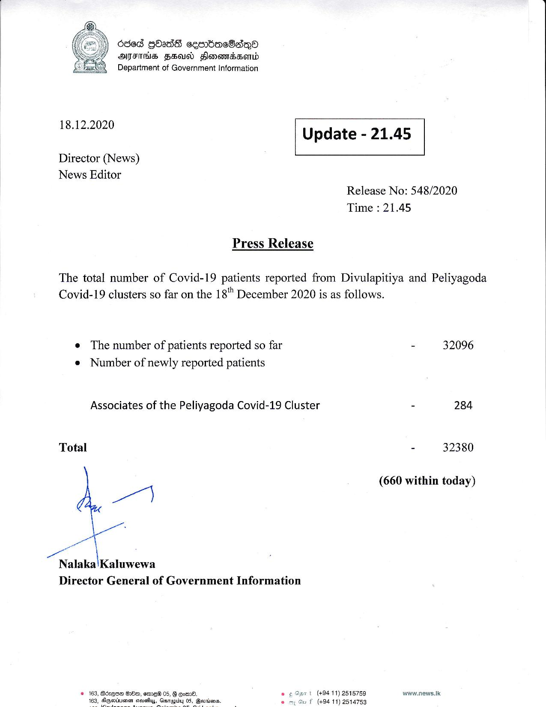

# Press Release - 2020.12.18 
Key: bd06c0667cea18dd4ae3ec745875412d 

---
```
630d QbadS ceerbaeBadeyO
ATFIHS FEU Hlonondsond
= Department of Government information

  

 

18.12.2020

 

Update - 21.45

 

 

Director (News)
News Editor

Release No: 548/2020
Time : 21.45

Press Release

The total number of Covid-19 patients reported from Divulapitiya and Peliyagoda
Covid-19 clusters so far on the 18" December 2020 is as follows.

e The number of patients reported so far
e Number of newly reported patients

Associates of the Peliyagoda Covid-19 Cluster

Total

wy
ae

wr

Nalaka'Kaluwewa
Director General of Government Information

© 163, Bdzqna Be, eme® 05, G gomd. © S50 (+9411) 2515759
8, © my Gu f (494 11) 2514753

    

- 32096

* 284

32380

(660 within today)

www.news.lk

 

```
