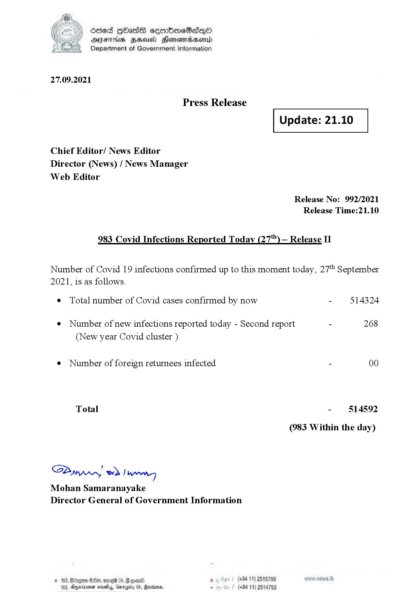

# Press Release - 2021.09.27 - Covid 19 Infection Report 
Key: bd7f7aa84b4374a509bb5c704a37a2cb 

---
```
dosed GOass eemmbmeSadepO
DFS BHU Honswnradasentd
Department of Government Information

 

 

27.09.2021

Press Release

Chief Editor/ News Editor
Director (News) / News Manager
Web Editor

 

 

Update: 21.10

 

 

Release No: 992/2021
Release Time:21.10

983 Covid Infections Reported Today (27) — Release II

Number of Covid 19 infections confirmed up to this moment today, 27" September

2021, is as follows.

¢ Total number of Covid cases confirmed by now

¢ Number of new infections reported today - Second report

(New year Covid cluster )

¢ Number of foreign returnees infected

Total

Saar eed } hang
Mohan Samaranayake
Director General of Government Information

© 163,

 

10, ODED 05, G comnd ,

(+94 11) 2515759
163, Agperxnsenen save, Garogiiry 05, Rarrionn, - (+94 11) 2514753

514324

268

00

514592

(983 Within the day)

```
