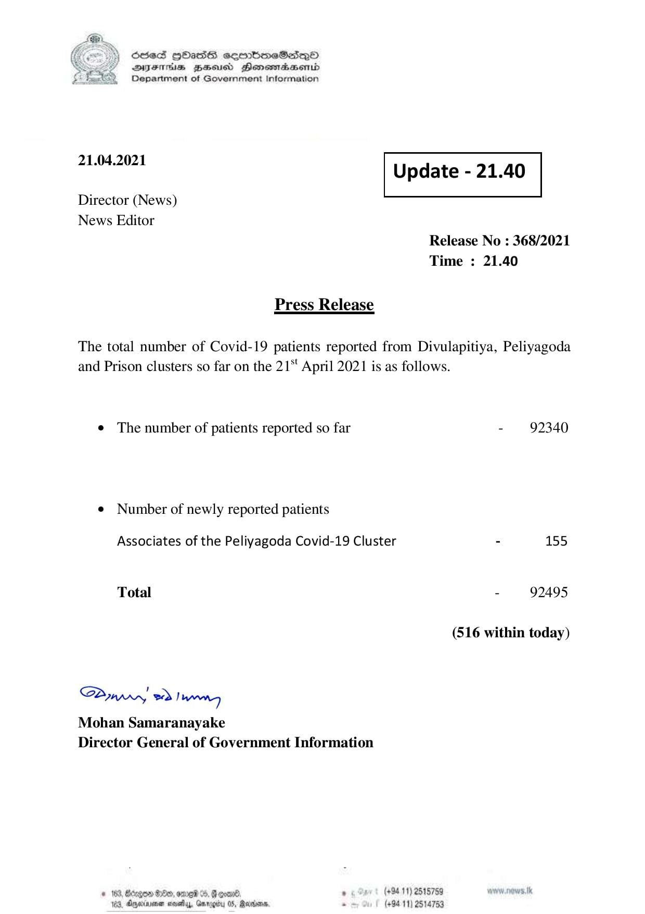

# Press Release - 2021.04.21 
Key: bdc1b59d1fb10600eeb48c3b92634840 

---
```
68365 HHasS soqrmimeSed—oO
DsFITHs Bess Henemadbasentd
Department of Government Information

21.04.2021 Update - 21.40

Director (News)
News Editor

 

Release No : 368/2021
Time : 21.40

Press Release
The total number of Covid-19 patients reported from Divulapitiya, Peliyagoda

and Prison clusters so far on the 21“ April 2021 is as follows.

e The number of patients reported so far - 92340

¢ Number of newly reported patients

Associates of the Peliyagoda Covid-19 Cluster - 155
Total - 92495
(516 within today)

Saw 2) wn
Mohan Samaranayake
Director General of Government Information

# 183, Benge S20, ome 0. G coal. . (+94 11) 2515789
Wea, Dryeciayenen ese, Garogibrs 05, Sara, . (494-11) 2514753

```
