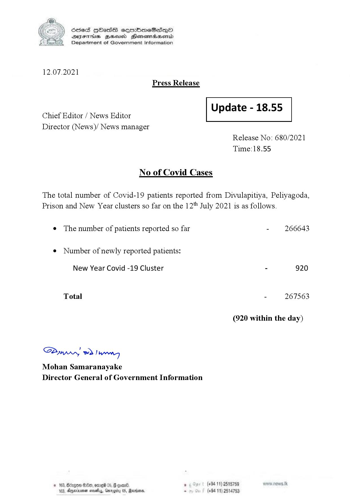

# Press Release - 2021.07.12 
Key: be70195f9ee067183e7ebdb33d193eea 

---
```
S) ScseS HOasdS cerrbmeSdQo
SVsThis geod Henssnadasombd
Department of Government Information

 

12.07.2021
Press Release

 

Update - 18.55

 

 

Chief Editor / News Editor
Director (News)/ News manager

 

Release No: 680/2021
Time:18.55

No of Covid Cases

The total number of Covid-19 patients reported from Divulapitiya, Peliyagoda,
Prison and New Year clusters so far on the 12" July 2021 is as follows.

e The number of patients reported so far - 266643

¢ Number of newly reported patients:

New Year Covid -19 Cluster - 920
Total - 267563
(920 within the day)

Saw 2) wn
Mohan Samaranayake
Director General of Government Information

© 163, Ded, omg 0 a0 . (+94 11) 2515759
183, Aperiaimen mavetyy, Garogiby 05, Rarer, - (+94 11) 2514753

```
