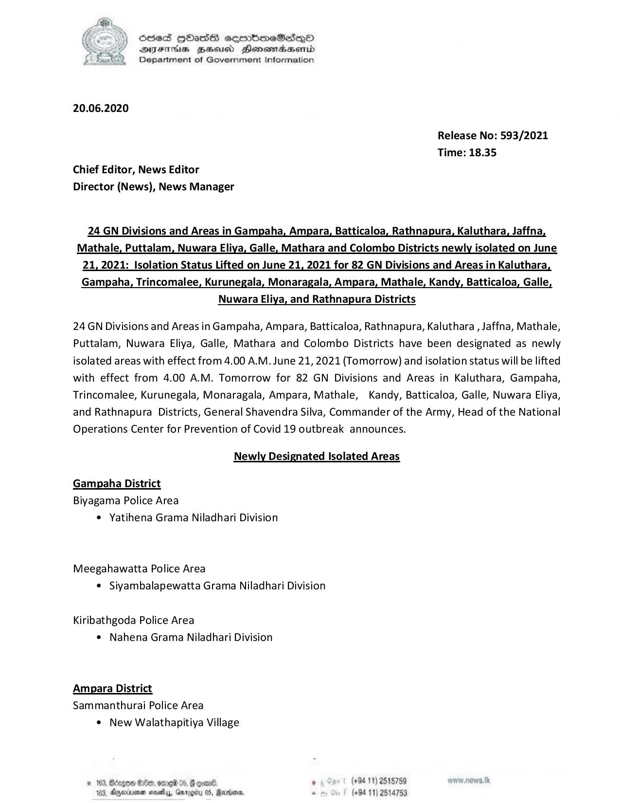

# Press Release - 2021.06.20 - Newly Isolated areas and isolated lifting areas from june 21( tomorrow) 
Key: bea82d97ffd9d41d39bb785de439c749 

---
```
GEG ) Sees HOass cermbmeSas—o0
DIFIHs HBHEaisd Honewtaaserd
Department of Government Information

 

20.06.2020

Release No: 593/2021
Time: 18.35

Chief Editor, News Editor

Director (News), News Manager

24 GN Divisions and Areas in Gampaha, Ampara, Batticaloa, Rathnapura, Kaluthara, Jaffna,
Mathale, Puttalam, Nuwara Eliya, Galle, Mathara and Colombo Districts newly isolated on June
21, 2021: Isolation Status Lifted on June 21, 2021 for 82 GN Divisions and Areas in Kaluthara
Gampaha, Trincomalee, Kurunegala, Monaragala, Ampara, Mathale, Kandy, Batticaloa, Galle,

Nuwara Eliya, and Rathnapura Districts

24 GN Divisions and Areas in Gampaha, Ampara, Batticaloa, Rathnapura, Kaluthara , Jaffna, Mathale,
Puttalam, Nuwara Eliya, Galle, Mathara and Colombo Districts have been designated as newly
isolated areas with effect from 4.00 A.M. June 21, 2021 (Tomorrow) and isolation status will be lifted
with effect from 4.00 A.M. Tomorrow for 82 GN Divisions and Areas in Kaluthara, Gampaha,
Trincomalee, Kurunegala, Monaragala, Ampara, Mathale, Kandy, Batticaloa, Galle, Nuwara Eliya,
and Rathnapura Districts, General Shavendra Silva, Commander of the Army, Head of the National
Operations Center for Prevention of Covid 19 outbreak announces.

Newly Designated Isolated Areas

Gampaha District
Biyagama Police Area

* Yatihena Grama Niladhari Division

Meegahawatta Police Area
© Siyambalapewatta Grama Niladhari Division

Kiribathgoda Police Area
* Nahena Grama Niladhari Division

Ampara District
Sammanthurai Police Area

° New Walathapitiya Village

’ (+94 11) 2515759 ws.Jk
ogi 0S, Rardin. . (+94 11) 2514753

   

```
