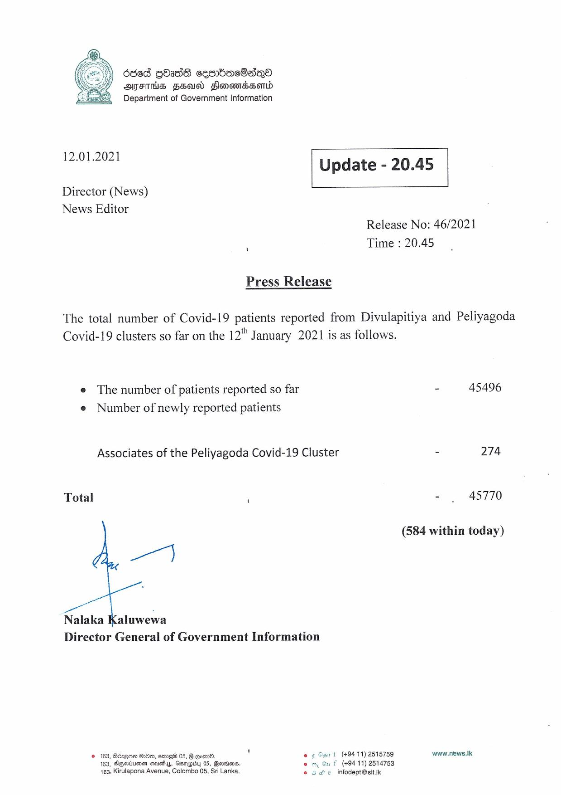

# Press Release - 2021.01.12 
Key: bfa22f51254be068547c8d2cefe4fb56 

---
```
686d GOass cesrbdbacOsqQo
AFITHS FEU Flonowssonld
Department of Government Information

 

 

12-01-2021 Update - 20.45

 

 

 

Director (News)
News Editor
Release No: 46/2021

Time : 20.45

Press Release
The total number of Covid-19 patients reported from Divulapitiya and Peliyagoda

Covid-19 clusters so far on the 12" January 2021 is as follows.

e The number of patients reported so far - 45496
e Number of newly reported patients

Associates of the Peliyagoda Covid-19 Cluster - 274

Total . - . 45770

(584 within today)

ey

go

Nalaka Kaluwewa
Director General of Government Information

© 163, Bdzque G80, emre® 05, § @om00. © ¢ Sart (+9411) 2515759 www.news.1k
163, Sgaiumer asa, Gsrepey 05, Bevriens. oj Gu f (49411) 2514753
163, Kirulapona Avenue, Colombo 08, Sri Lanka, Sb ie InodsesK

```
