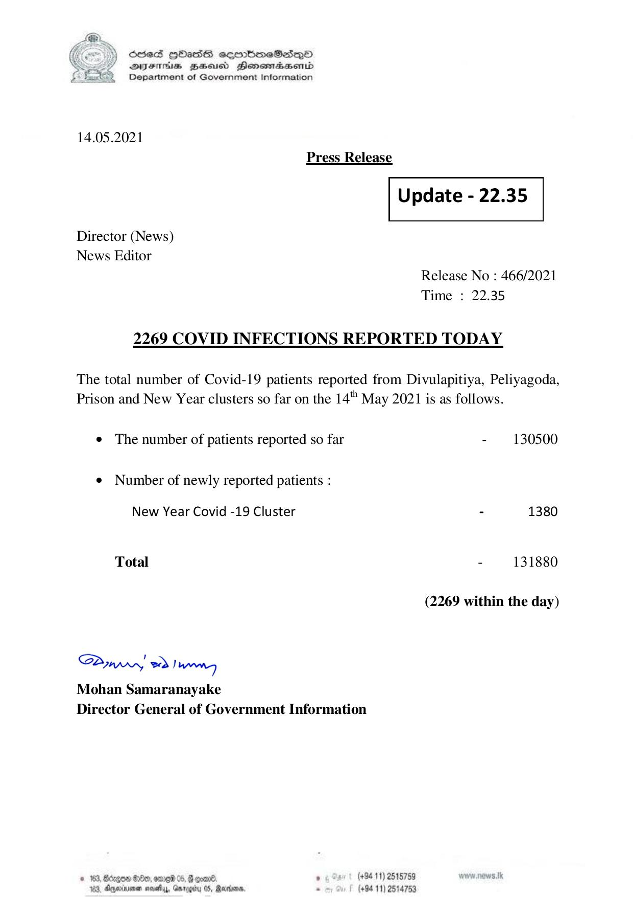

# Press Release - 2021.05.14 - Covid 19 infection report 
Key: c0146f8abf29b4677a53b7ebf3f9c49e 

---
```
) ScdeS HOadS cermbmeSsdQo
SUES Zeid Henesrdaembd
Department of Government Information

 

14.05.2021
Press Release

 

Update - 22.35

 

 

 

Director (News)
News Editor

Release No : 466/2021
Time : 22.35

2269 COVID INFECTIONS REPORTED TODAY

The total number of Covid-19 patients reported from Divulapitiya, Peliyagoda,
Prison and New Year clusters so far on the 14" May 2021 is as follows.

¢ The number of patients reported so far - 130500

¢ Number of newly reported patients :

New Year Covid -19 Cluster - 1380
Total - 131880
(2269 within the day)

Saw eo) wenn
Mohan Samaranayake
Director General of Government Information

© 163, Bcrgow $80, omreid 05,  coan® , (+94 11) 2515789
183, Aperinsna sasety, Gnrogiry 05, Racers - (+94 11) 2514753

```
