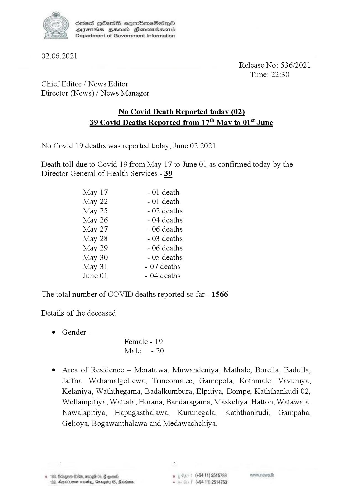

# Press Release - 2021.06.02 - Covid 19 infection deaths 
Key: c04e36af353f775d91e98f4d7fc9528f 

---
```
| Scied HObasS sermimeSesqQoO
SVYsEThs BHsusd Henemadasemid
Department of Government Information

 

02.06.2021
Release No: 536/2021
Time: 22:30
Chief Editor / News Editor
Director (News) / News Manager

No Covid Death Reported today (02)
39 Covid Deaths Reported from 17" May to 01% June

No Covid 19 deaths was reported today, June 02 2021

Death toll due to Covid 19 from May 17 to June 01 as confirmed today by the
Director General of Health Services - 39

May 17 - 01 death
May 22 - 01 death
May 25 - 02 deaths
May 26 - 04 deaths
May 27 - 06 deaths
May 28 - 03 deaths
May 29 - 06 deaths
May 30 - 05 deaths
May 31 - 07 deaths
June 01 - 04 deaths

The total number of COVID deaths reported so far - 1566
Details of the deceased

© Gender -
Female - 19
Male -20

e Area of Residence — Moratuwa, Muwandeniya, Mathale, Borella, Badulla,
Jaffna, Wahamalgollewa, Trincomalee, Gamopola, Kothmale, Vavuniya,
Kelaniya, Waththegama, Badalkumbura, Elpitiya, Dompe, Kaththankudi 02,
Wellampitiya, Wattala, Horana, Bandaragama, Maskeliya, Hatton, Watawala,
Nawalapitiya, Hapugasthalawa, Kurunegala, Kaththankudi, Gampaha,
Gelioya, Bogawanthalawa and Medawachchiya.

BEd, omg 05, @ come. . (+94 11) 2515759
163, Dnexnenan nelly, Garogity 05, Revisor, . (+94 11) 2514753

 

 

```
