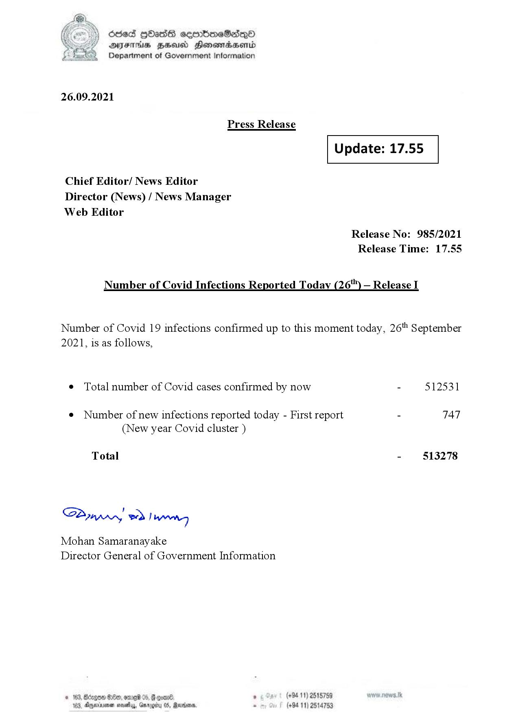

# Press Release - 2021.09.26 
Key: c09e53c6163beafb6fba72df62b105b7 

---
```
fe) Oded Hbas eeenbmeSedeqQO
DFS HHS Honsmadserid
Department of Government Information

 

26.09.2021

Press Release

 

Update: 17.55

 

 

 

Chief Editor/ News Editor
Director (News) / News Manager
Web Editor

Release No: 985/2021
Release Time: 17.55

Number of Covid Infections Reported Today (26) — Release I

Number of Covid 19 infections confirmed up to this moment today, 26" September
2021, is as follows,

¢ Total number of Covid cases confirmed by now - 512531

¢ Number of new infections reported today - First report - TAT
(New year Covid cluster )

Total - 513278

SPynprny wd! weg

Mohan Samaranayake
Director General of Government Information

® (+94 11) 2515759
(+94 11) 2514753

© 163, Bdrgon Ge, ome 04
103, Dexrmen novelas, Garogi

  

```
